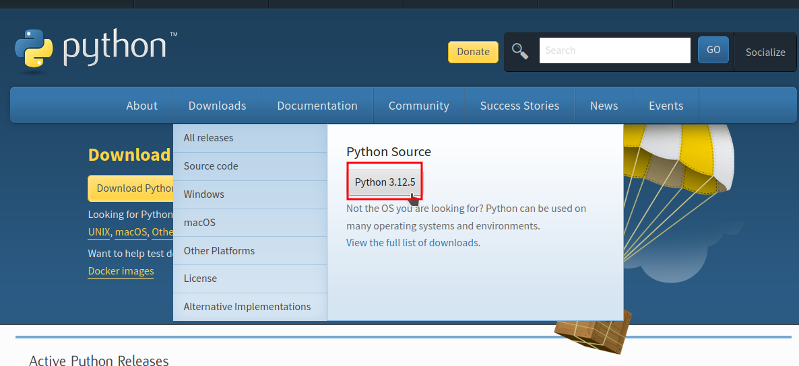
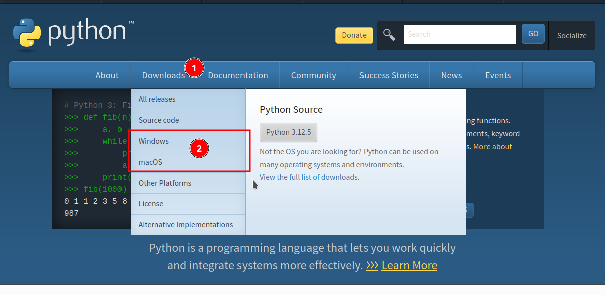
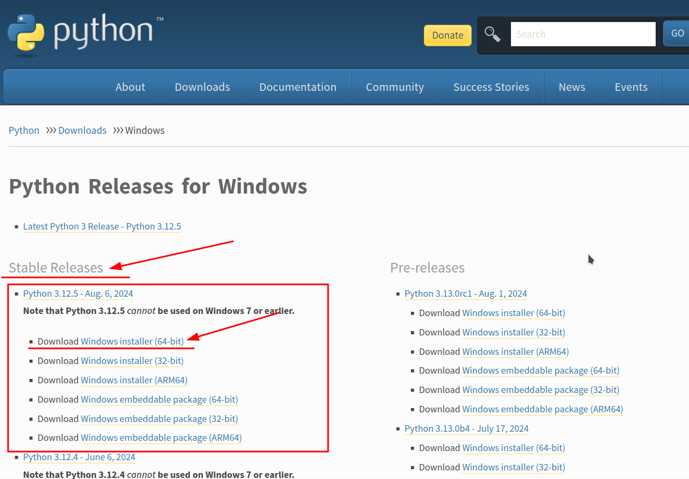

# 1. Introducción a Python

 un lenguaje de programación multiparadigma, ya que soporta parcialmente la orientación a objetos, programación imperativa y, en menor medida, programación funcional. Es un lenguaje interpretado, dinámico y multiplataforma.

## 1.1 Instalación de Python

Para instalar Python se entra a su sitio oficial <https://www.python.org/>

Al momento de realizar esta documentación estamos en la versión 3.12.1

## 1.2 Instalación de Python en Windows

Se elige para la versión del sistema operativo. En esta caso vamos a suponer que tenemos una versión de Windows a 64 bits (x64).
Elegimos la versión [Windows x86-64 executable installer](https://www.python.org/downloads/windows/)

Al ejecutar el instalador se debe **activar la creación del `PATH`** (variable de entorno), para que se agregue de forma automática y se pueda ocupar en la linea de comando (CMD) de Windows.

## 1.3 Tipos de lenguajes de programación

- Lenguaje **COMPILADO**
- Lenguaje **INTERPRETADO**  JIT (Just In Time)

## 1.4 Ventajas de Python

- Multiplaforma
- Open Source
- Corre en diferentes arquitecturas
- Es utilizado en Backend
- Se puede programar tarjetas electrónicas y microcontroladores

---

Realizado por el Instructor: [Alejandro Leyva](https://www.alejandro-leyva.com/)
