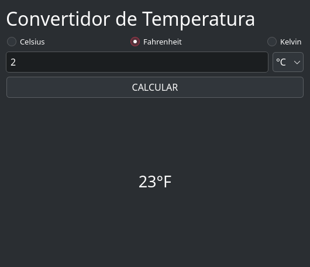

# Ejercicios

## Básicos

1. Realizar el cálculo del perímetro de un cuadrado, con datos en memoria, e imprimir el resultado
2. Realizar el cálculo del perímetro y area de un rectángulo, solicitando el lado de la figura al usuario, e imprimir el resultado, primero perímetro, y después el area.
3. Realizar el cálculo del area de un cuadrado, solicitando el lado de la figura al usuario, e imprimir el resultado
4. Realizar un programa que realice el cálculo de Fuerza en la segunda Ley de Newton. La formula es ==$Fuerza = masa * aceleración$==. Solicitando al usuario las variables necesarias.
5. Realizar una calculadora que convierta de centímetros a pulgadas, solicitando el dato al usuario, e imprimir el resultado. ==_1 In = 2.54cm_==
6. Convertidor de temperatura de Fahrenheit a Celsius. $C=\frac{5}{9}(F - 32)$

## Decisiones

1. Realizar una calculadora básica, que realice la operación de sumar, restar, multiplicar, dividir. Al comenzar muestre un menu y el usuario elija la opción deseada. Se debe pedir el primer valor y el segundo, con ello realizar la operación
2. Solicitar un número entero al usuario, e imprimir por pantalla si es valor par o impar
3. Hacer una calculadora de áreas geométricas, las opciones son:
    - Área del cuadrado
    - Área del círculo
    - Área del triángulo
    - Con opción de salir del programa y al final imprimir el resultado con la frase "El área del figura nombre de la figura elegida es resultado"

4. Hacer una calculadora de ley de ohms, las opciones son:
    - Calcular resistencia
    - Calcular corriente
    - Calcular voltaje
    - Calcular potencia
    - Con opción de salir del programa y al final debe imprimir el resultado con la frase "El resultado es: XX"

5. Que resuelva una ecuación de segundo orden, aplicando la fórmula general; recuerda que no existen las raíces negativas. Debe entregarle los valores de las raíces o en caso que alguna o ninguna raíz exista, indicarlo. _==Nota: Debes usar las funciones matemáticas que vienen en el lenguaje==_
6. Realizar una calculadora del Teorema de Pitágoras, el usuario debe elegir, cateto opuesto, adyacente o hipotenusa, salir, que desear calcular. _==Nota: Debes usar las funciones matemáticas que vienen en el lenguaje==_
7. Hacer una caja registradora, que reciba el valor del producto y al final entregue el costo total con IVA y sin IVA; es decir, En total es _\$18.35_ y con IVA son _\$21.28_, recordar que el IVA es del _16%_

## Operadores lógicos

1. Solicitar al usuario su promedio actual, en valor entero, el algoritmo debe tomar la decisión con basé al número ingresado, y dar un mensaje (ver la tabla)

      | Rango de calificación  | Mensaje a imprimir                        |
      | ---------------------- | ----------------------------------------- |
      | 0 a menor que 6        | "lastima margarito"                       |
      | 6 a menor que 7        | "Aplícate"                                |
      | 7 a menor que 8        | "Apenitas y la libraste, metele papí"     |
      | 8 a menor que 9        | "Bastante bien, puedes mejorar"           |
      | 9 a menor que 10       | "muy bien amiguito, te ganaste la cheve!" |
      | Igual a 10             | "Excelente, tu muy bien"                  |
      | Menor a 0 y mayor a 10 | "Calificación no posible"                 |

2. Cálculo de BMI (Indice de Masa Corporal) para peso y altura, indicando cual es tu BMI y en que nivel de obesidad te encuentras (_Ver tabla_). La formula es $BMI = peso (kg) * estatura^2 (cm)$

      | IMC                | Nivel de peso |
      | ------------------ | ------------- |
      | Por debajo de 18.5 | Bajo peso     |
      | 18.5 – 24.9        | Normal        |
      | 25.0 – 29.9        | Sobrepeso     |
      | 30.0 o más         | Obesidad      |

3. Mandar la letra del múltiplo o submultiple correspondiente, es decir, si el usuario ingresa el valor de 1,000, el valor que se debe desplegar por pantalla es la letra "K", si el usuario ingresa el valor de 0.02, se debe desplegar por pantalla la letra "m"

      | Unidad | Símbolo | Rango       |
      | ------ | ------- | ----------- |
      | pico   | p       | $x10^{-12}$ |
      | nano   | n       | $x10^{-}$   |
      | micro  | u       | $x10^{-6}$  |
      | mili   | m       | $x10^{-3}$  |
      | unidad |         |       1     |
      | kilo   | K       | $x10^{3}$   |
      | mega   | M       | $x10^{6}$   |
      | giga   | G       | $x10^{9}$   |

## Ciclos `while` y con `for`

Todos estos ejercicios se debe implementar un ciclo `while` y otro con la version del `for` . No esta permitido hacer uso de las funciones propias del lenguaje que pueden resolver algún problema o alguna parte de el, a menos que lo indique en la instrucción.

1. Imprimir del 1 al 99.
2. Imprimir una tabla de equivalencia de temperaturas de Celsius y Fahrenheit. Desde 0ºC hasta 100ºC. Es decir, 0C -> 32F, 1C -> 33.8F, 2C -> 35.6F ..... 99C -> 210.2, 100C -> 212F
3. Calcular el promedio final, solicita al usuario sus calificaciones parciales una a una, y al final da el mensaje "Aprobado", en caso que haya pasado arriba de 6 y "Estas en repite" si es menor. Considerando que son 3 parciales.
4. Imprimir la tabla del 8, desde ==_8x1=8 hasta 8x10=80_==.
5. Realizar un programa para visualizar la tabla de multiplicar que desee el usuario, el usuario dará el valor para la tabla, la tabla debe de ir desde el 1 hasta el 10, es decir, por ejemplo si da el numero 3, la tabla comienza en _==3x1=3 ... hasta 3x10=30==_
6. Realizar un programa para visualizar la tabla de multiplicar que desee el usuario, el usuario dará el valor para la tabla, también debe dar el limite donde comienza hasta donde termina, es decir, por ejemplo si da el numero 5, comenzando desde _==el 3 hasta el 25, comenzara la tabla 5x3 = 15 ... 5x25=125==_
7. Leer 10 números enteros, solicitando uno a uno al usuario, e imprimir al final cuántos fueron par y cuántos impar.
8. Calcular el factorial de un número entero. Se le solicita al usuario que ingrese un número entero el cuál quiere calcular el factorial del mismo. ==Ejemplo: 5! = 120==
9. Calcular la potencia de un número, solicita al usuario el número que desea elevar y después la base a la cuál lo elevara. Ejemplo: _==2^2= 4, 2^3=8==_
10. Leer 10 números, solicitando uno a uno al usuario, y al final se imprime por pantalla el número más alto ingresado de los 10.
11. Calculadora de la segunda ley de newton. Sale el menú indicando que desea calcular y la opción de salir. Después solicita al usuario los valores que conoce e imprimir el resultado, una vez termina de hacer todas las operaciones, debe regresar al menú inicial, debe existir una opción para terminal el programa, en caso que coloque una opción no existen, debe volver a mostrar el mensaje.
12. Cálculo de la media de un conjunto de datos. Se le pregunta al usuario cuantos números son, comienza a pedirlos uno a uno y al final imprime el resultado de la media de todos los datos.
13. Cálculo de la media de un conjunto de datos positivos. En cada iteración pregunta al usuario si quiere terminar para conocer el resultado o ingresar otro valor. Cuando elija terminar, imprimir el valor total del promedio o media.
14. Realizar un programa que solicite las calificaciones del parcial; es decir, irá pidiendo una a una las calificaciones, y al final que diga si te vas a _recursamiento o no_
15. Algoritmo para convertir número decimal a binario, debe ir mostrando el numero en binario uno a uno, no es todo el numero binario completo, comenzando por el bit mas significativo. Por ejemplo el usuario ingresa el valor de 5, debe imprimir 101. Dado que 5 en binario es 101.
16. Una pastelería nos solicita realizar un programa para una maquina de pastelitos, las opciones son las siguientes

      

    - Debe ir sumando las opciones que elije que elija el usuario. Pero cada vez que termine de elegir, debe volver a mostrar el menú, hasta que el usuario elija terminar debe imprimir la cantidad total a pagar. El usuario en cualquier momento puede terminar la orden y la maquina debe darle la cantidad a pagar.
    - Por ejemplo, al inicio muestra el menu de pastel, cupcake y salir. Si elije, pastel, ahora le muestra las opciones de chocolate, vainilla, natural y salir, el usuario elije vainilla, y por ultimo elije chispas, debe preguntar si añade algo mas, si es asi, vuelve a mostrar el menu inicial. En caso que elija que ya termino, debe imprimir la cantidad que debe pagar, es decir, (5+1+0.5) "Cantidad a pagar \$6.5".
    - Recuerda el usuario puede salir en cualquier momento y debe recibir la cantidad que debe pagar.
    - Extra:
      - Generar un listado de todo lo que solicito, es decir, generar una especie de ticket y al final dar el valor a pagar

17. Realizar una calculadora de ley de Ohm, al inicio te da el menú para seleccionar que se desea calcular; para terminar el programa se debe dar la opción de salida, si no el programa sigue mostrando el menu inicial, si el usuario ingresa un valor y "no existe en el menu", manda mensaje que la opción no existe y vuelve a mostrar el menu. El resultado lo debe lanzar en el mejor formato, es decir, si el resultado es 1,000 ohms, en pantalla debe salir 1k, si es posible agregar el símbolo de Omega ($\Omega$) para resistencias, de lo contrario colocar la palabra **"Ohms"**. Si el resultado es 0.005A en pantalla debe salir 5mA. El usuario debe ingresar el valor sin redondear, es decir, si son 10mA debe ingresar -> 0.01A, si el valor es 10k$\Omega$ debe ingresar -> 10000.

## Strings

1. De la siguiente frase "python es la onda, todo el mundo debería aprender python desde cero". Verifica si la palabra "python" está en una oración `find()`.
2. De la siguiente frase "python es la onda, todo el mundo debería aprender python desde cero". Reemplaza la palabra "python" por "JAVA" en la primera ocasión, después por "JavaScript"; es decir, vas a imprimir 2 veces la frase.
3. Solicita una frase y debes cambiar las letras por símbolos. Frase de entrada: `Amigo bueno`, salida: `4m1g0 b(_)3n0`

    | Letra     | Reemplazo común |
    | --------- | --------------- |
    | **A / a** | `4` o `@`|
    | **E / e** | `3` o `€`|
    | **I / i** | `1`|
    | **O / o** | `0`|
    | **U / u** | `(_)`|

4. Extrae todas los letras de una cadena y devuélvelos como una nueva cadena (p. ej. "abc123d4" → "1234").
5. Extrae todos los dígitos de una cadena y devuélvelos como una nueva cadena (p. ej. "abc123d4" → "abc").
6. Convierte una frase como "Hola Mundo En Python" a "hola_mundo_en_python".

## Colecciones

1. Crea una lista con 5 números enteros y muéstrala por pantalla utilizando un ciclo.
2. Genera una lista de 20 números random enteros (tu eliges el limite del máximo), después imprime cada uno, indicando cuales son par e impar. Ejemplo `12 -> par`.
3. Genera una lista de 10 números random enteros (tu eliges el limite del máximo), la imprimes despues, cambias los valores que están en posiciones _par_ por un "0". Ejemplo: `[10, 20, 30, 40, 50]` -> `[10, 20, 0, 40, 0]`.
4. Dada la lista `paises = ['Chile', 'Perú', 'Ecuador', 'México', 'España']`, imprime el primer elemento, el último elemento y el elemento en el índice 2.
5. Genera una lista de 10 edades random (numero máximo) usa `count()` para determinar y mostrar cuántas personas son mayores de edad.
6. Dadas `lista_a = [1, 2, 3]` y `lista_b = [4, 5]`, usa `extend()` para agregar todos los elementos de lista_b al final de lista_a.
7. Dada la tupla `datos = ("Ana", 28, "Ingeniera")`, desempaqueta sus valores en tres variables (`nombre, edad, profesion`) y luego imprímelos.
8. Crea un diccionario llamado `usuarios`. La clave debe ser un nombre de usuario y el valor debe ser otro diccionario con claves 'email' y 'activo'. Agrega dos usuarios.
9. Dado el diccionario `persona = {"nombre": "Ana", "edad": 23, "ciudad": "México"}`, muestra el valor de la clave "ciudad".
10. Crea un diccionario con información de tres estudiantes, donde cada valor sea otro diccionario con edad, carrera y promedio.
11. Crea un diccionario con nombres de productos y sus precios. Luego, pide al usuario el nombre de un producto y muestra su precio.

## Funciones

1. Define una función `celsius_a_fahrenheit(c)` que convierta una temperatura de Celsius a Fahrenheit.
2. Crea una función `area_circulo(radio)` que calcule el área y otra que sea `perimetro_circulo(radio)` que calcule el perimetro
3. Escribe una función `mayor(a, b)` que retorne el número más grande entre dos valores.
4. Define `promedio(lista)` que devuelva el promedio de los números de la lista.
5. Crea una función `contar_letra(texto, letra)` que cuente cuántas veces aparece una letra en el texto.
6. Crea `sumar_todo(*args)` que acepte cualquier cantidad de números y devuelva su suma.
7. Crea una función que reciba dos números y una operación (+, -, *, /) y retorne el resultado.
8. Escribe una función que valide si una contraseña cumple con: mínimo 8 caracteres, al menos una mayúscula, una minúscula y un número.
9. Analizador de texto Desarrolla una función que analice un texto y retorne estadísticas: palabras más frecuentes, promedio de longitud de palabras, etc.

## Archivos

1. Crea una función que escriba una lista de nombres en un archivo de texto, uno por línea.
2. Desarrolla una función que cuente cuántas líneas tiene un archivo de texto.
3. Escribe una función que busque una palabra específica en un archivo y retorne en qué líneas aparece.
4. Desarrolla una función que copie el contenido de un archivo a otro archivo nuevo.
5.

## Errores

1. Define una `función dividir(a, b)` que intente dividir a entre b. Usa try...except para manejar la excepción `ZeroDivisionError` e imprime un mensaje de error si ocurre.


## POO

### 1. Clase Persona

```text
-------------------
|     Persona     |
-------------------
| - nombre: str   |
| - edad: int     |
-------------------
| + __init__()    |
| + mostrar_info()|
-------------------
```

**Descripción:**

- Crea una clase `Persona` con atributos privados `nombre (str)` y `edad (int)`.
- Implementa un método `__init__` para inicializar los atributos.
- Añade un método `mostrar_info` que imprima el nombre y la edad de la persona.

### 2. Clase Coche

```text
-------------------
|     Coche       |
-------------------
| - marca: str    |
| - modelo: str   |
| - año: int      |
-------------------
| + __init__()    |
| + arrancar()    |
| + detener()     |
-------------------
```

**Descripción:**

- Crea una clase `Coche` con atributos privados marca, modelo y año.
- Implementa un método `__init__` para inicializar los atributos.
- Añade métodos `arrancar` y `detener` que impriman mensajes como "El coche ha arrancado" y "El coche se ha detenido".

### 3. CuentaBancaria

```text
----------------------------
|     CuentaBancaria       |
----------------------------
| - titular: str           |
| - saldo: float           |
----------------------------
| + __init__()             |
| + depositar(monto: float)|
| + retirar(monto: float)  |
| + mostrar_saldo()        |
----------------------------
```

**Descripción:**

- Crea una clase `CuentaBancaria` con atributos privados titular (str) y saldo (float).
- Implementa un método `__init__` para inicializar los atributos.
- Añade métodos `depositar` y `retirar` para modificar el saldo.
- Implementa un método `mostrar_saldo` que imprima el saldo actual.

### 4. Rectángulo

```text
----------------------------
|     Rectangulo           |
----------------------------
| - ancho: float           |
| - alto: float            |
----------------------------
| + __init__()             |
| + calcular_area()        |
| + calcular_perimetro()   |
----------------------------
```

**Descripción:**

- Crea una clase `Rectangulo` con atributos privados ancho y alto.
- Implementa un método `__init__` para inicializar los atributos.
- Añade métodos `calcular_area` y `calcular_perimetro` que devuelvan el área y el perímetro del rectángulo, respectivamente.

### 5. Estudiante

```text
----------------------------
|     Estudiante           |
----------------------------
| - nombre: str            |
| - edad: int              |
| - cursos: list[str]      |
----------------------------
| + __init__()             |
| + inscribir_curso(curso: str)|
| + mostrar_cursos()       |
----------------------------
```

**Descripción:**

- Crea una clase `Estudiante` con atributos privados nombre, edad y cursos (una lista de strings).
- Implementa un método `__init__` para inicializar los atributos.
- Añade un método `inscribir_curso` que permita añadir un curso a la lista.
- Implementa un método `mostrar_cursos` que imprima todos los cursos en los que está inscrito el estudiante.

### Herencia

1. Crea una clase base Animal con un método `hacer_sonido()`, y luego crea dos subclases `Perro` y `Gato` que sobrescriban ese método con sonidos específicos.
2. Define una clase `Vehiculo` con atributos `marca` y `modelo` (son pasados al constructor), y un método `mostrar_info()`. Luego, crea una subclase `Coche` que agregue el atributo puertas. Usa super() para reutilizar el constructor de Vehiculo.
3. Crea una clase `Persona` con atributos `nombre` y `edad`, y un método `saludar()`. Luego, crea una subclase `Empleado` que agregue un atributo `salario` y un método `trabajar()`.
4. Crea una clase `Figura` con un método `area()`. Luego, crea subclases `Cuadrado` y `Círculo` que sobrescriban el método `area()` con las fórmulas correspondientes.
5. Crea una clase `Motor` y una clase `Coche` que contenga un Motor (es decir, que reciba como argumento el constructor). Luego, crea otra clase `Motocicleta` que herede de `Coche` y usa composición para evitar repetir código.

## GUI (Qt)

### Calculadora de la Segunda ley de Newton

Realizar una aplicación visual para el calculo de la segunda ley de Newton.


### Divisor de tensión

En esta aplicación el objetivo es obtener el voltaje de salida, se debe colocar

- voltaje de entrada
- El valor de R1 en ohms
- El valor de R2 en ohms


#### Extras

- **Poder elegir que se desea calcular**, es decir, quiero calcular R1, por ende, los demás datos se deben colocar. Se puede colocar algún widget en el elijamos cual es el datos a calcular, es a libre elección.

### Código de colores

Se debe obtener el valor de la resistencia con base a los colores que se elijan, cada vez que cambien un valor se actualice el resultado de la resistencia.


#### Extras

- Agregar la opción para que sea elija si es de 4 o 5 bandas
- Crear una app para resistencias SMD
- Indica si al resistencia formada es comercial o no

### Ley de Ohms

Aplicación de calculo de ley de ohms.


#### Extras

- Agregar que se elija el submúltiplo (mili, micro) y múltiplo (kilo, mega) a cada unidad, es decir, `mA`, `kΩ`, `mV`.

### Convertidor de Temperaturas (Celsius - Fahrenheit - Kelvin)

Tener una entrada de texto para colocar la temperatura, a un lado un combo box para seleccionar la temperatura de entrada y para seleccionar el tipo de temperatura con un radioButton, y un botón para generar el calculo.



<details markdown="1">

Código ejemplo del archivo **.ui**

```xml
<?xml version="1.0" encoding="UTF-8"?>
<ui version="4.0">
 <class>Form</class>
 <widget class="QWidget" name="Form">
  <property name="geometry">
   <rect>
    <x>0</x>
    <y>0</y>
    <width>530</width>
    <height>456</height>
   </rect>
  </property>
  <property name="windowTitle">
   <string>Convertidor de Temperatura</string>
  </property>
  <layout class="QVBoxLayout" name="verticalLayout">
   <item>
    <widget class="QLabel" name="label">
     <property name="sizePolicy">
      <sizepolicy hsizetype="Preferred" vsizetype="Minimum">
       <horstretch>0</horstretch>
       <verstretch>0</verstretch>
      </sizepolicy>
     </property>
     <property name="font">
      <font>
       <pointsize>24</pointsize>
      </font>
     </property>
     <property name="text">
      <string>Convertidor de Temperatura</string>
     </property>
    </widget>
   </item>
   <item>
    <layout class="QHBoxLayout" name="horizontalLayout">
     <item>
      <widget class="QRadioButton" name="radioButton">
       <property name="text">
        <string>Celsius</string>
       </property>
      </widget>
     </item>
     <item>
      <spacer name="horizontalSpacer">
       <property name="orientation">
        <enum>Qt::Orientation::Horizontal</enum>
       </property>
       <property name="sizeHint" stdset="0">
        <size>
         <width>40</width>
         <height>20</height>
        </size>
       </property>
      </spacer>
     </item>
     <item>
      <widget class="QRadioButton" name="radioButton_2">
       <property name="text">
        <string>Fahrenheit</string>
       </property>
       <property name="checked">
        <bool>true</bool>
       </property>
      </widget>
     </item>
     <item>
      <spacer name="horizontalSpacer_2">
       <property name="orientation">
        <enum>Qt::Orientation::Horizontal</enum>
       </property>
       <property name="sizeHint" stdset="0">
        <size>
         <width>40</width>
         <height>20</height>
        </size>
       </property>
      </spacer>
     </item>
     <item>
      <widget class="QRadioButton" name="radioButton_3">
       <property name="text">
        <string>Kelvin</string>
       </property>
      </widget>
     </item>
    </layout>
   </item>
   <item>
    <layout class="QHBoxLayout" name="horizontalLayout_2">
     <item>
      <widget class="QLineEdit" name="lineEdit">
       <property name="font">
        <font>
         <pointsize>12</pointsize>
        </font>
       </property>
       <property name="text">
        <string>2</string>
       </property>
      </widget>
     </item>
     <item>
      <widget class="QComboBox" name="comboBox">
       <property name="font">
        <font>
         <pointsize>12</pointsize>
        </font>
       </property>
       <item>
        <property name="text">
         <string>°C</string>
        </property>
       </item>
       <item>
        <property name="text">
         <string>°F</string>
        </property>
       </item>
       <item>
        <property name="text">
         <string>°K</string>
        </property>
       </item>
      </widget>
     </item>
    </layout>
   </item>
   <item>
    <widget class="QPushButton" name="pushButton">
     <property name="font">
      <font>
       <pointsize>12</pointsize>
      </font>
     </property>
     <property name="text">
      <string>CALCULAR</string>
     </property>
    </widget>
   </item>
   <item>
    <widget class="QLabel" name="label_2">
     <property name="sizePolicy">
      <sizepolicy hsizetype="Preferred" vsizetype="Preferred">
       <horstretch>0</horstretch>
       <verstretch>1</verstretch>
      </sizepolicy>
     </property>
     <property name="font">
      <font>
       <pointsize>20</pointsize>
      </font>
     </property>
     <property name="text">
      <string>23°F</string>
     </property>
     <property name="alignment">
      <set>Qt::AlignmentFlag::AlignCenter</set>
     </property>
    </widget>
   </item>
  </layout>
 </widget>
 <resources/>
 <connections/>
</ui>
```

</details>

### To-do (Tareas por hacer)

Un gestor de tareas por hacer,

- Agregar tarea
- Eliminar tarea
- Editar el contenido de la tarea
- Cambiar de estado la tarea
- **Usar una base de datos**

### Estadística inferencial

Se deben poder leer **n** numero de datos, y generar una salida con los siguientes datos:

Mostrar los datos en una tabla y a un lado las variables estadísticas:

- Media
- Moda
- Mediana
- Desviación estándar
- Varianza
