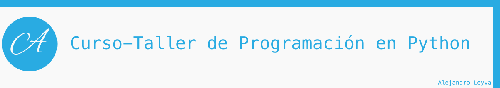

# 14. Errores `try-except`

Para crear un buen software y no generar malas experiencias de usuario, siempre se le debe indicar al usuario de la manera mas clara para el, porque ha fallado el programa o que ha realizado mal, ademas que no queremos que el programa cierre inesperadamente o cancele lo que estaba realizando; para todo esto tenemos una forma de manejo de errores, el cual se llama **`try-except`**.

## Bloque de errores

Para `atrapar` un error se debe utilizar un bloque `try`, en se coloca el código habitual, pero que sabemos que nos puede generar un error al realizar su operación, posteriormente debemos coloca un bloque que se encarga de realizar la tarea que debe resolver o indicar el error al usuario, es el bloque `except`.

### Sintaxis

```python

try:

    # código a ejecutar de manera normal

except Exception as e:
    # código que se ejecuta si el bloque de arriba falla
    print(e) # mandamos a imprimir el error

```

## Tipos de errores

Existen diversos tipos de errores que se pueden producir en nuestro codigo, solo algunos de ellos son:

- `SyntaxError`: Error de sintaxis
- `TypeError`: Error en el tipo de dato
- `ValueError`: Error en el tipo de valor
- `ZeroDivisionError`: Error generado en un division por cero
- `Exception`: Es el error general de todos

### Jerarquía de errores

```text
BaseException
 ├── BaseExceptionGroup
 ├── GeneratorExit
 ├── KeyboardInterrupt
 ├── SystemExit
 └── Exception
      ├── ArithmeticError
      │    ├── FloatingPointError
      │    ├── OverflowError
      │    └── ZeroDivisionError
      ├── AssertionError
      ├── AttributeError
      ├── BufferError
      ├── EOFError
      ├── ExceptionGroup [BaseExceptionGroup]
      ├── ImportError
      │    └── ModuleNotFoundError
      ├── LookupError
      │    ├── IndexError
      │    └── KeyError
      ├── MemoryError
      ├── NameError
      │    └── UnboundLocalError
      ├── OSError
      │    ├── BlockingIOError
      │    ├── ChildProcessError
      │    ├── ConnectionError
      │    │    ├── BrokenPipeError
      │    │    ├── ConnectionAbortedError
      │    │    ├── ConnectionRefusedError
      │    │    └── ConnectionResetError
      │    ├── FileExistsError
      │    ├── FileNotFoundError
      │    ├── InterruptedError
      │    ├── IsADirectoryError
      │    ├── NotADirectoryError
      │    ├── PermissionError
      │    ├── ProcessLookupError
      │    └── TimeoutError
      ├── ReferenceError
      ├── RuntimeError
      │    ├── NotImplementedError
      │    └── RecursionError
      ├── StopAsyncIteration
      ├── StopIteration
      ├── SyntaxError
      │    └── IndentationError
      │         └── TabError
      ├── SystemError
      ├── TypeError
      ├── ValueError
      │    └── UnicodeError
      │         ├── UnicodeDecodeError
      │         ├── UnicodeEncodeError
      │         └── UnicodeTranslateError
      └── Warning
           ├── BytesWarning
           ├── DeprecationWarning
           ├── EncodingWarning
           ├── FutureWarning
           ├── ImportWarning
           ├── PendingDeprecationWarning
           ├── ResourceWarning
           ├── RuntimeWarning
           ├── SyntaxWarning
           ├── UnicodeWarning
           └── UserWarning
```

Mas información en <https://docs.python.org/3/library/exceptions.html>
