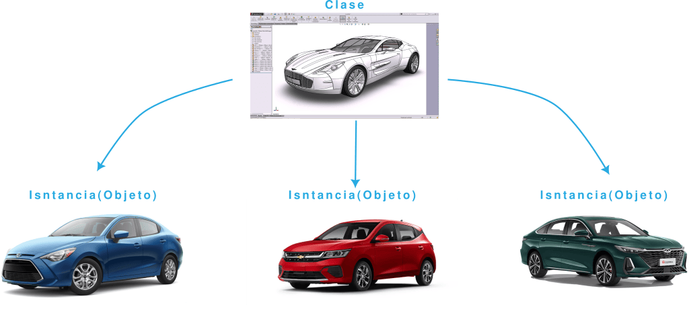
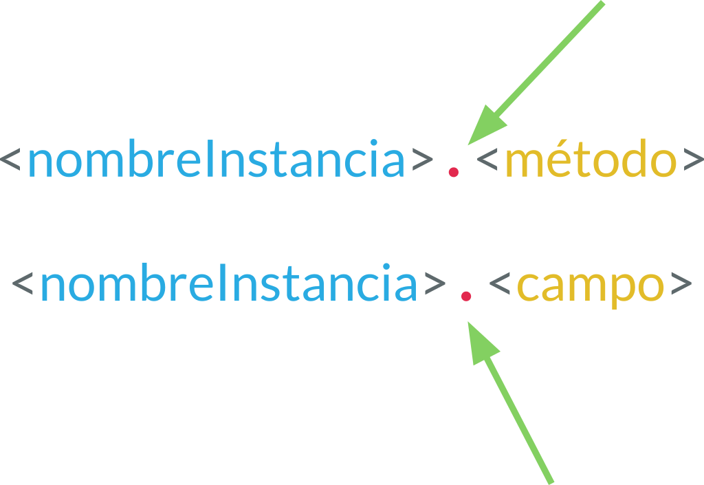

# 15. Programación Orientada a Objetos

## Introducción a la Programación Orientada a Objetos

La programación orienta a objetos es un paradigma de programación, lo cual esta enfocado en la abstracción del mundo real a código de programación; es decir, es una representación de las cosas del mundo en un archivo con código, el cual tiene los atributos y comportamientos.

> Los programas se construyen a partir de definiciones de objetos y definiciones de funciones; la mayoría de los cómputos se hacen con base en objetos.
> Cada definición de objetos corresponde a algún concepto o cosa del mundo real, y las funciones que operan sobre esos objetos corresponden a las maneras en que los conceptos o cosas reales interactúan

### Clase

**Clase** se le denomina a un archivo que tiene la definición de nuestro objeto o clase.

>La clase es donde se declaran los atributos y métodos.


### Atributos y Comportamientos

Las clases contienen sus atributos y sus métodos (*no siempre es necesario que los tenga*).


### ¿Qué es un atributo?

Es un **campo** o **propiedad** que se declara en la clase; es decir, que tiene el objeto, por ejemplo, `cantidadPuertas = 4`, indicamos el numero de puertas de nuestra clase `Carro`.

### ¿Qué es un método?

- Es un **comportamiento** (acción) que realiza un objeto (cosa).
- Una secuencia de pasos ordenados.s
- Es un bloque o secuencia de código que se repite continuamente.
- Hace una sola tarea, y lo hace muy bien.
- Su nombre se define con un verbo (acción).
- Funciones de un objeto.
- Modifica estados.

**Los métodos son como las funciones**, pero con dos diferencias:

- Los métodos se definen adentro de una definición de clase, a fin de marcar explícitamente la relación entre la clase y éstos.
- La sintaxis para llamar o invocar un método es distinta que para las funciones.

### Instancia

Una instancia es la creación o invocación de un objeto; es decir, después de crear la clase podemos crear una instancia (objeto) para después, ser usado. Es como en el ejemplo del auto, primer fue diseñado y después, fue construido en una fabrica para ser usado.



### *self*

Al momento de crear una clase se debe ocupar la palabra reservada `self`, la cual indica o hace referencia a la propia clase; indica que el método o campo de la propia clase. Siempre se debe usar dentro de una clase, fuera de ella no funciona.

## POO

### Creando una clase

**Creando una clase vacía.** Se usa una palabra reservada `class` el nombre de la clase (*usando la convención CamelCase*) y termina con dos puntos; colocamos `pass` con su respectiva indentation, para que la clase quede vacía sin declaración de métodos y campos.

```python
class MyCar:
    pass
```

### Agregando campos a la clase

La declaración de campos globales, es lo mismo que estuviéramos declarando variables convencionales, sin embargo, estas solo pertenecen a la clase.

```python
class MyCar:

    color = "Blue"
    on = False

```

### Agregando métodos a la clase

Se declara con la palabra reservada `def`, al igual que cualquier funcional, pero dentro de una clase los métodos deben recibir como primer argumento **siempre** la palabra `self`, esto indica que pertenece a la clase.

```python
class Car:
    color = "Blue"
    on = False

    def sayName(self):
        print("A car")
```

### Creando una instancia (objeto)

Para crear una instancia se debe escribir el mismo nombre de la clase y agregar paréntesis (muy similar a llamar una función)

Para acceder a los campos y métodos de una clase se hace con la notación de punto; `<instancia>`**.**`<campo>` o `<instancia>`**.**`<método>()`

```python
class Car:
    color = "Blue"
    on = False

    def sayName(self):
        print("A car")


car = Car()         # se crea la instancia
print(car.color)    # se invoca un campo de la instancia
print(car.on)       # se invoca un campo de la instancia
car.sayName()       # se invoca un método de la instancia
```

```text
    Blue
    False
    A car
```

### Utilizando los campos dentro de la clase

Si queremos utilizar los campos o métodos de la propia clase, dentro de un método, se debe llamar, colocando primero la palabra `<self>`**.**`<campo>` o `<self>`**.**`<método>()`



```python
class Car:

    color = "Blue"
    on = False

    def sayName(self):
        print("A car")

    def description(self):
        message = f"A car with a color: {self.color} and is turn on: {self.on}"
        return message

    def message(self):
        print("+" * 10)
        print(self.description())
        print("+" * 10)


car = Car()
print(car.color)
print(car.on)
car.sayName()
print(car.description())
car.message()
```

```text
    Blue
    False
    A car
    A car with a color: Blue and is turn on: False
    ++++++++++
    A car with a color: Blue and is turn on: False
    ++++++++++
```

### Ejemplos

Crear una clase, con las siguientes indicaciones, después crear una instancia, llamar sus campos y métodos

#### Ejemplo 1

- **Clase:** Auto
- **Atributos**:
    - noPuertas: int
    - kilometraje: float
- **Comportamientos**:
  - acelerar(): void
  - arrancar(): void

### Ejercicios

Crear una clase, con las siguientes indicaciones, después crear una instancia, llamar sus campos y métodos

#### Ejercicio 1

- **Clase:** Persona
- **Atributos:**
    - nombre: String
    - edad: int
- **Métodos:**
    - saludar(): void
    - decir_edad(): void

#### Ejercicio 2

- **Clase:** Perro
- **Atributos:**
    - nombre  : String
    - raza : String
- **Métodos:**
    - ladrar():  void
    - correr(int velocidad):  void
    - jugar():  String : (pelota, hueso, chancla)

## Encapsulamiento

### Niveles de acceso

los niveles de acceso no son tan estrictos como en otros lenguajes orientados a objetos como Java o C#. Python implementa un sistema basado en **convenciones** y no en **restricciones estrictas**.

Los niveles de acceso son:

- **public**
- **protected**
- **private**

#### Público (public)

Los atributos y métodos públicos son accesibles desde cualquier parte del código. por defecto, todo es público.

```python
class Persona:

    nombre = "Juan"

    def saludar(self):
        print(f"Hola, me llamo {self.nombre}")


persona = Persona()
print(persona.nombre)  # Acceso directo
persona.saludar()      # Acceso directo
```

#### Protegido (\_) (protected)

Los atributos y métodos protegidos se indican con un guion bajo al principio del nombre (`_nombre`). Esto es solo una convención, y se espera que los desarrolladores no accedan a ellos directamente fuera de la clase o de sus subclases. Sin embargo, técnicamente siguen siendo accesibles.

```python
class Persona:

    _nombre = "Mario"  # Protegido

    def _saludar(self):  # Método protegido
        print(f"Hola, soy {self._nombre} (protegido)")


persona = Persona()
print(persona._nombre)  # Accesible, aunque no recomendado
persona._saludar()      # Accesible, aunque no recomendado

```

#### Privado (__doble_guion_bajo)

Los atributos y métodos privados se indican con dos guiones bajos al principio del nombre (`__nombre`).

```python
class Persona:

    __nombre = "Juan"  # Privado

    def __saludar(self):  # Método privado
        print(f"Hola, soy {self.__nombre} (privado)")

    def mostrar_nombre(self):  # Método público para acceder a __nombre
        print(self.__nombre)


persona = Persona()
persona.mostrar_nombre()  # Acceso indirecto
print(persona.__nombre)  # Error: AttributeError
persona.__saludar()     # Error: AttributeError

```

- **Convención vs Restricción**: En Python, `_` y `__` son más sobre cómo comunicar la intención de acceso que sobre evitarlo estrictamente.
- Usa `__` para datos que realmente necesitan ser privados y protegidos contra modificaciones accidentales.
- Usa `_` para señalar que un atributo o método es solo para uso interno.

### Constructor &#95;&#95;init&#95;&#95;

Un constructor es un método especial en una clase que se llama automáticamente cuando se crea una nueva instancia de esa clase. En Python, el constructor se define mediante el método especial `__init__`.

El Constructor en Python

Un constructor es un método especial en una clase que se llama automáticamente cuando se crea una nueva instancia de esa clase. En Python, el constructor se define mediante el método especial **init**.

#### Características del Constructor

- **Inicialización Automática**: Se ejecuta al crear una instancia de la clase.
- **Propósito principal**: Inicializar atributos de la instancia con valores específicos o predeterminados.

```python
class Clase:
    def __init__(self, parametros):
        # Inicialización de atributos

```

- Es un método mágico (o dunder, por "double underscore").
- Se utiliza para inicializar atributos de la clase.
- Es opcional. Si no defines un constructor, Python utiliza un constructor por defecto que no realiza ninguna acción específica.
- Parámetro `self`:
    - Representa la instancia actual de la clase.
    - Es obligatorio en los métodos de instancia, incluyendo `__init__`.
    - Permite acceder y modificar los atributos de la instancia.

```python
class Persona:
    def __init__(self, nombre, edad):
        self.nombre = nombre  # Atributo de instancia
        self.edad = edad      # Atributo de instancia

    def mostrar_informacion(self):
        print(f"Nombre: {self.nombre}, Edad: {self.edad}")

# Crear una instancia
persona = Persona("Juan", 30)
persona.mostrar_informacion()  # Salida: Nombre: Juan, Edad: 30

```

#### Tipos de Constructores

**Constructor por Defecto**: No acepta parámetros más allá de `self`.

```python
class Persona:
    def __init__(self):
        self.nombre = "Desconocido"
        self.edad = 0


persona = Persona()
print(persona.nombre)  # Desconocido

```

**Constructor con Parámetros:** Acepta parámetros para inicializar atributos.

```python
class Persona:
    def __init__(self, nombre, edad):
        self.nombre = nombre
        self.edad = edad


persona = Persona("María", 25)
print(persona.nombre)  #  María
```

**Constructor con valores predeterminados**:

```python
class Persona:
    def __init__(self, nombre="Anónimo", edad=18):
        self.nombre = nombre
        self.edad = edad


persona1 = Persona()
persona2 = Persona("Luis", 40)
print(persona1.nombre)  # Anónimo
print(persona2.nombre)  # Luis

```

**Sobrecarga de Constructores**: Python no soporta sobrecarga de constructores directamente. Puedes simularla utilizando valores predeterminados o lógica dentro del constructor.

```python
class Persona:

    def __init__(self, nombre=None, edad=None):
        if nombre is None and (edad is None or edad == 0):
            self.nombre = "Desconocido"
            self.edad = 0
        elif edad is None:
            self.nombre = nombre
            self.edad = 0
        elif nombre is None:
            self.nombre = "Desconocido"
            self.edad = edad
        else:
            self.nombre = nombre
            self.edad = edad


persona1 = Persona()
persona2 = Persona("Luis")
persona3 = Persona("Ana", 30)
persona4 = Persona(edad=30)
print(persona1.nombre, persona1.edad)  # Desconocido 0
print(persona2.nombre, persona2.edad)  # Luis 0
print(persona3.nombre, persona3.edad)  # Ana 30
print(persona4.nombre, persona4.edad)  # Desconocido 30

```

##### Buenas Prácticas

- Define los atributos claramente dentro del constructor.
- Valida los parámetros para evitar inconsistencias en los objetos.
- Utiliza `__init__` únicamente para inicializar atributos. Evita realizar lógica compleja.
- Documenta el constructor con docstrings para explicar los parámetros.

#### Ejemplo 2

- Un constructor que inicializa los atributos `nombre` y `edad` de una clase.

```python
class Persona:
    def __init__(self, nombre, edad):
        self.nombre = nombre
        self.edad = edad

    def mostrar_informacion(self):
        print(f"Nombre: {self.nombre}, Edad: {self.edad}")


persona = Persona("Carlos", 25)
persona.mostrar_informacion()

```

#### Ejemplo 3

- El constructor asigna valores predeterminados si no se pasan argumentos.

- **Clase:** Auto
- **Constructor**: tipo: str, marca: str
- **Atributos**:
    - tipo: -str
    - marca: -str
- **Comportamientos**:
  - mostrar_informacion(): void

```python
class Auto:
    def __init__(self, tipo="Coche", marca="Genérica"):
        self.tipo = tipo
        self.marca = marca

    def mostrar_informacion(self):
        print(f"Tipo: {self.tipo}, Marca: {self.marca}")


auto1 = Auto()
auto2 = Auto("Moto", "Yamaha")
auto1.mostrar_informacion()
auto2.mostrar_informacion()

```

#### Ejercicio 3

- **Clase:** Libro
- **Constructor**: titulo, auto, publicacion
- **Atributos**:
    Título : -str
    Autor : -str
    Año de publicación: -str
- **Comportamientos**:
  - mostrar_informacion():+ void

#### Ejercicio 4

- **Clase:** Circulo
- **Constructor**: radio
- **Atributos**:
    radio : -float
- **Comportamientos**:
  - get_area(): + float
  - get_perimetro(): + float
  - mostrar_datos(): + void

<!-- TODO: SETTER Y GETTER PENDIENTES -->

### Métodos Estáticos

En Python, un método estático es un método que pertenece a una clase pero no está ligado a una instancia específica de esa clase. No puede acceder ni modificar el estado de la instancia (atributos de la instancia) ni el de la clase (atributos de la clase).

Para definir un método estático, se utiliza el decorador `@staticmethod`.

#### Características principales de un método estático

1. No recibe `self` ni `cls` como primer parámetro:
   - Esto lo diferencia de los métodos de instancia (que reciben self) y los métodos de clase (que reciben cls).
2. Se comporta como una función ordinaria dentro de una clase
   - Aunque esté definido dentro de la clase, no puede acceder a atributos o métodos de instancia o clase.
3. Útil para funcionalidad independiente
   - Se utiliza para definir funciones que no dependen de la clase ni de sus instancias pero tienen sentido en el contexto de la clase.

#### Como implementarlo e invocarlo

```python
class Example:
    @staticmethod
    def static_method(arg1, arg2):
        return f"Static method called with {arg1} and {arg2}"

##################################################

example = Example()

# Invocación desde la clase
print(Example.static_method(10, 20))

# Invocación desde la instancia
print(example.static_method(30, 40))

```

#### ¿Cuándo usar métodos estáticos?

- Cuando necesitas una función que esté relacionada con una clase de forma lógica pero no necesite acceder a atributos o métodos de la clase o de sus instancias.
- Ejemplo
  - Validaciones
  - Utilidades matemáticas
  - Operaciones de transformación de datos

```python
class MathUtils:
    @staticmethod
    def add(a, b):
        return a + b

    @staticmethod
    def multiply(a, b):
        return a * b

# Uso
print(MathUtils.add(3, 5))       # 8
print(MathUtils.multiply(3, 5)) # 15

```

## Mini proyecto POO básico

Haremos un simple gestor para un almacén de componentes electrónicos, aplicando las bases de POO.

- clase `Component`: sera el objeto del componente electrónico
- clase `Inventory`: sera el que maneje el archivo como base de datos y el CRUD

```python
import csv
import os
import uuid


class Component:
    """
    Represents an electronic component in the store.
    Attributes:
        component_id (str): Unique ID of the component.
        name (str): Name of the component.
        quantity (int): Quantity of the component in stock.
        price (float): Price of the component.
    """

    def __init__(
        self, name: str, description: str = "", quantity: int = 0, id: str | None = None
    ):
        self.id = str(uuid.uuid4())[:6] if not id else id
        self.name = name
        self.description = description
        self.quantity = quantity

    @staticmethod
    def get_columns():
        return [
            "ID",
            "Name",
            "Description",
            "Quantity",
        ]

    def __str__(self):
        return f"id: {self.id}, name: {self.name}, description {self.description}, quantity: {self.quantity}"


class Inventory:
    """
    Manages the inventory of electronic components.
    Attributes:
        file_name (str): Name of the CSV file used to store component data.
    Methods:
        add_component(): Adds a new component to the inventory.
        update_component(): Updates the details of an existing component.
        delete_component(): Deletes a component from the inventory.
        view_inventory(): Displays all components in the inventory.
        save_to_csv(): Saves the inventory to a CSV file.
        load_from_csv(): Loads inventory data from a CSV file.
    """

    def __init__(self, file_name: str = "inventory.csv"):
        self.components = []
        self.file_name = file_name
        if not self._exist_csv():
            self._create_csv(self.file_name)
        else:
            self._load_data()

    def _exist_csv(self):
        return os.path.exists(self.file_name)

    def _create_csv(self, path_file):
        with open(path_file, mode="w", newline="") as file:
            writer = csv.writer(file)
            writer.writerow(Component.get_columns())

    def add_component(self, new_component: Component):
        """
        Adds a new component to the inventory.

        Args:
            component_id (str): The ID of the component.
            name (str): The name of the component.
            quantity (int): The quantity of the component.
            unit_price (float): The unit price of the component.
        """
        self.components.append(self._add(component=new_component))
        self._save_data()
        print("Component added successfully.")

    def _add(self, component: Component):
        return {"id": component.id, "component": component}

    def _save_data(self):
        """
        Saves the current inventory data to the CSV file.
        """
        with open(self.file_name, mode="w+", newline="") as file:
            fields = Component.get_columns()
            writer = csv.DictWriter(file, fieldnames=fields)
            writer.writeheader()
            for component in self.components:
                component = component["component"]
                writer.writerow(
                    {
                        Component.get_columns()[0]: component.id,
                        Component.get_columns()[1]: component.name,
                        Component.get_columns()[2]: component.description,
                        Component.get_columns()[3]: component.quantity,
                    }
                )

    def update_component(self, id: str, component_to_update: Component):
        """Updates the details of an existing component."""
        old_components = self.components
        self.components = []
        change = False

        for component in old_components:
            if component["id"] == id:
                old_component = component["component"]
                print(f"new update {component_to_update}")
                print(f"old component {old_component}")
                old_component.name = (
                    component_to_update.name
                    if component_to_update.name
                    else old_component.name
                )
                old_component.description = (
                    component_to_update.description
                    if component_to_update.description
                    else old_component.description
                )
                old_component.quantity = (
                    component_to_update.quantity
                    if component_to_update.quantity
                    else old_component.quantity
                )
                change = True
                print("Component updated")
                component = self._add(old_component)
            self.components.append(component)
        if not change:
            print("Not found ID")
        else:
            self._save_data()

    def delete_component(self, component_id):
        """Deletes a component from the inventory."""
        old_components = self.components
        self.components = []
        for component in old_components:
            if not component["id"] == component_id:
                self.components.append(component)
                print(f"Component with ID {component_id} deleted.")
        self._save_data()

    def view_inventory(self):
        """Displays all components in the inventory."""
        print("=" * 80)
        for component in self.components:
            print(component["component"])
        print("=" * 80)

    def _load_data(self):
        """
        Loads inventory data from the CSV file into memory.
        If the file does not exist, no data is loaded.
        """
        if self._exist_csv():
            with open(self.file_name, mode="r") as file:
                reader = csv.DictReader(file)
                for row in reader:
                    component = Component(
                        id=row[Component.get_columns()[0]],
                        name=row[Component.get_columns()[1]],
                        description=row[Component.get_columns()[2]],
                        quantity=int(row[Component.get_columns()[3]]),
                    )

                    self.components.append(self._add(component))
        else:
            print("CSV file not found. A new file will be created upon saving data.")


if __name__ == "__main__":
    inventory = Inventory()

    while True:
        print("*" * 80)
        print("Electronic Components Inventory Management")
        print("1. Add Component")
        print("2. Update Component")
        print("3. Delete Component")
        print("4. View Inventory")
        print("5. Exit")

        choice = input("Enter your choice: ")

        if choice == "1":
            name = input("Enter component name: ")
            description = input("Enter component description: ")
            quantity = int(input("Enter quantity: "))
            inventory.add_component(
                Component(name=name, description=description, quantity=quantity)
            )
        elif choice == "2":
            component_id = input("Enter component ID to update: ")
            name = input("Enter new name (leave blank to skip): ")
            description = input("Enter new description (leave blank to skip): ")
            quantity = input("Enter new quantity (leave blank to skip): ")
            inventory.update_component(
                id=component_id,
                component_to_update=Component(
                    name=name or None,
                    description=description or None,
                    quantity=quantity if int(quantity) else 0,
                ),
            )
            inventory.view_inventory()
        elif choice == "3":
            component_id = input("Enter component ID to delete: ")
            inventory.delete_component(component_id)
        elif choice == "4":
            inventory.view_inventory()
        elif choice == "5":
            print("Exiting program.")
            break
        else:
            print("Invalid choice. Please try again.")
```

## Herencia

La herencia es un mecanismo clave en la programación orientada a objetos (POO) que permite construir clases nuevas basándose en clases existentes. A través de la herencia, las clases hijas adquieren las propiedades y métodos de las clases padres, facilitando la creación de jerarquías y promoviendo la reutilización de código.

### Conceptos básicos de herencia

- **Clase padre**: Es la clase base o superior de la que otras clases derivan atributos y métodos.
- **Clase hija**: Es la clase que hereda de la clase padre. Puede extender o modificar el comportamiento de la clase base.
- **Método `super()`**: Permite acceder a métodos y atributos de la clase padre desde la clase hija.

### Aplicaciones de la herencia

- **Reutilización de código**: Crear clases generales con funcionalidades comunes para luego especializarlas en clases hijas.
  - **Ejemplo**: Una clase base Empleado y clases derivadas Gerente, Ingeniero, etc.
- **Extensión de funcionalidad**: Añadir o modificar el comportamiento de la clase base.
  - **Ejemplo**: Personalizar métodos como `hacer_sonido()` en animales.
- **Modelado de sistemas complejos**: Representar jerarquías o relaciones entre objetos.
  - **Ejemplo**: Sistemas de transporte, zoológicos, videojuegos con diferentes personajes.
- **Polimorfismo**: Usar métodos con el mismo nombre en diferentes clases para comportamientos adaptados.

### Ventajas y desventajas de la herencia

#### Ventajas

- Promueve la reutilización y evita la duplicación de código.
- Facilita la comprensión de relaciones jerárquicas.
- Mejora la organización del código, especialmente en sistemas complejos.

#### Desventajas

- Si se abusa, puede hacer que las jerarquías sean demasiado profundas y difíciles de mantener.
- La herencia múltiple puede generar problemas de ambigüedad en métodos o atributos.
- Puede ser más difícil de depurar y comprender en sistemas muy grandes.

### Sintaxis de herencia

```python
class ClasePadre:
    pass

class ClaseHija(ClasePadre):
    # Métodos y atributos adicionales o sobreescritos
    pass

class ClaseHijaHija(ClaseHija):
    # Métodos y atributos adicionales o sobreescritos
    pass
```

### Tipos de herencia

#### Herencia simple

Una clase hija hereda de una sola clase padre.

```python
class ClaseHija(ClasePadre1):
    pass

```

#### Herencia múltiple

Una clase hija hereda de múltiples clases padres.

```python
class ClaseHija(ClasePadre1, ClasePadre2):
    pass

```

#### Herencia multinivel

Una clase hija actúa como padre de otra clase hija.

```python
class ClaseBase:
    pass

class ClaseIntermedia(ClaseBase):
    pass

class ClaseDerivada(ClaseIntermedia):
    pass

```

#### Herencia jerárquica

Múltiples clases hijas heredan de una misma clase padre.

```python
class ClaseHija1(ClasePadre1):
    pass

class ClaseHija2(ClasePadre1):
    pass

```

### Sobreescritura de métodos

La sobreescritura de métodos (method overriding) es un concepto de la programación orientada a objetos en el que una clase hija redefine un método heredado de la clase padre para cambiar su comportamiento. Este mecanismo permite a las clases hijas proporcionar su propia implementación específica de un método que ya existe en la clase base.

#### Características principales de la sobreescritura de métodos

1. **Herencia**: Solo puedes sobrescribir métodos que han sido heredados de una clase padre.
2. **Mismo nombre y firma**: El método sobrescrito debe tener el mismo nombre y la misma cantidad de parámetros (firma) que el método en la clase padre.
3. **Acceso a la clase padre**: Aunque no es obligatorio, puedes usar super() para llamar al método original de la clase padre dentro del método sobrescrito.

#### Reglas de la sobreescritura

1. El método en la clase hija debe tener el mismo nombre que el método en la clase padre.
2. La cantidad y tipo de parámetros deben coincidir (aunque Python no requiere tipado estricto, es buena práctica mantener la coherencia).
3. Los métodos sobrescritos pueden usar `super()` si necesitan reutilizar parte de la funcionalidad de la clase padre.

#### Importancia de la sobreescritura

- **Especialización**: Permite que las clases hijas adapten el comportamiento heredado para cumplir requisitos específicos.
- **Polimorfismo**: Facilita el uso de objetos de diferentes clases de forma uniforme, utilizando el método sobrescrito adecuado según el tipo de objeto.
- **Extensión de funcionalidad**: Permite personalizar o ampliar el comportamiento de una clase base sin modificarla directamente.

#### Limitaciones y cuidado con la sobreescritura

- **Compatibilidad**: Si el método sobrescrito tiene diferentes parámetros o rompe la funcionalidad base, puede generar errores en el uso del programa.
- **Complejidad**: En jerarquías profundas, puede ser difícil rastrear cuál método se está ejecutando.

### Ejemplos de herencia

#### Ejemplo 1

```python
class Animal:
    def hacer_sonido(self):
        return "Este animal hace un sonido genérico."

class Perro(Animal):
    def hacer_sonido(self):
        return "¡Guau, guau!"

class Gato(Animal):
    def hacer_sonido(self):
        return "¡Miau, miau!"

# Pruebas
animales = [Animal(), Perro(), Gato()]
for animal in animales:
    print(animal.hacer_sonido())

```

#### Ejemplo 2

```python
class Auto:
    def velocidad_maxima(self):
        return "La velocidad máxima es genérica."

class Coche(Auto):
    def velocidad_maxima(self):
        return "La velocidad máxima del coche es 200 km/h."

class Moto(Auto):
    def velocidad_maxima(self):
        return "La velocidad máxima de la moto es 95 km/h."

# Pruebas
autos = [Auto(), Coche(), Moto()]
for auto in autos:
    print(auto.velocidad_maxima())

```

#### Ejemplo 3

```python
class Empleado:
    def calcular_salario(self):
        return "El salario base es de $1000."

class Gerente(Empleado):
    def calcular_salario(self):
        return "El salario del gerente es de $5000."

class Ingeniero(Empleado):
    def calcular_salario(self):
        return "El salario del ingeniero es de $3000."

# Pruebas
empleados = [Empleado(), Gerente(), Ingeniero()]
for empleado in empleados:
    print(empleado.calcular_salario())

```

#### Ejemplo 4

```python
class Figura:
    def area(self):
        return "No se puede calcular el área de una figura genérica."

class Cuadrado(Figura):
    def __init__(self, lado):
        self.lado = lado

    def area(self):
        return f"El área del cuadrado es {self.lado ** 2}."

class Circulo(Figura):
    def __init__(self, radio):
        self.radio = radio

    def area(self):
        return f"El área del círculo es {3.14159 * (self.radio ** 2):.2f}."

# Pruebas
figuras = [Figura(), Cuadrado(4), Circulo(3)]
for figura in figuras:
    print(figura.area())

```

#### Ejemplo 5

```python
class Auto:
    def tipo(self):
        return "Vehículo genérico."

class Coche(Auto):
    def tipo(self):
        return "Coche de cuatro ruedas."

class Deportivo(Coche):
    def tipo(self):
        return "Coche deportivo de alto rendimiento."

# Pruebas
autos = [Auto(), Coche(), Deportivo()]
for auto in autos:
    print(auto.tipo())

```

### Sobre escritura de &#95;&#95;str&#95;&#95;

Cuando mandamos un objeto al método `print()`, éste por default llama al método `__str__` del objeto. Si el método no ha sido sobrescrito veremos algo como `<__main__.Objeto object at 0x7f17bcc31700>`, esto lo que nos indica es la posición de la memoria de dicho objeto. Pero, nosotros no queremos ver eso, deseamos algo mas descriptivo o el estado de lo que contiene el objeto.
Lo que se debe colocar en el método `__str__` es totalmente arbitrario, obviamente debe ser algo que nos sea util, ademas que si dicho método en el clase padre ya contiene algo, podemos cambiarlo en la clase hija.

```python
class Persona:
    def __init__(self, nombre):
        self.nombre = nombre

    def __str__(self):
        return f"Persona. nombre={self.nombre} :D"


# Prueba
persona = Persona("Carlos")
print(persona)
```

### Ejercicios

<!-- TODO: agregar ejercicios de sobre escritura sin ocupar super  -->

### El Método `super()`

**El método super() se utiliza para acceder a métodos y atributos de la clase padre desde una clase hija.** Es una herramienta poderosa en la programación orientada a objetos porque permite extender o reutilizar funcionalidad heredada sin necesidad de referenciar directamente el nombre de la clase padre.

#### Características del método `super()`

- **Reutilización de código**: Permite llamar a métodos de la clase base sin duplicar su implementación en la clase derivada.
- **Mantenimiento simplificado**: Si la clase padre cambia, las clases hijas no necesitan actualizar las referencias directas a la clase base.

#### Sintaxis

```python
class ClasePadre:
    def metodo(self):
        print("Método en la ClasePadre")

class ClaseHija(ClasePadre):
    def metodo(self):
        super().metodo()  # Llamada al método de la clase padre
        print("Método en la ClaseHija")

```

#### Ejemplos `super()`

```python
class Padre:
    def __init__(self, atributo):
        self.atributo = atributo

class Hija(Padre):
    def __init__(self, atributo, otro_atributo):
        super().__init__(atributo)  # Inicializa el atributo en la clase Padre
        self.otro_atributo = otro_atributo

    def mostrar_atributos(self):
        print(f"Atributo de Padre: {self.atributo}")
        print(f"Atributo de Hija: {self.otro_atributo}")

# Prueba
hija = Hija("Valor del padre", "Valor de la hija")
hija.mostrar_atributos()

```

```python
class Padre:
    def __init__(self):
        self._atributo_protegido = "Soy un atributo protegido"

class Hija(Padre):
    def mostrar_atributo(self):
        print(f"Atributo protegido: {self._atributo_protegido}")

# Prueba
hija = Hija()
hija.mostrar_atributo()
```

#### Ejercicios

- **Ejercicio 1**: Uso de `super()` en constructores
    - Crea una clase base llamada `Vehiculo` con atributos `marca` y `modelo`. Crea una clase hija llamada `Coche` que además incluya el atributo `puertas`. Usa `super()` para inicializar los atributos de la clase base desde la clase hija.

- **Ejercicio 2**: Extender un método heredado
    - Define una clase `Empleado` con un método `salario_base` que imprima un salario fijo. Crea una clase hija `Gerente` que sobrescriba este método para imprimir el salario base más un bono adicional, usando `super()`.

---

Referencia: <https://docs.python.org/es/3/tutorial/classes.html>
