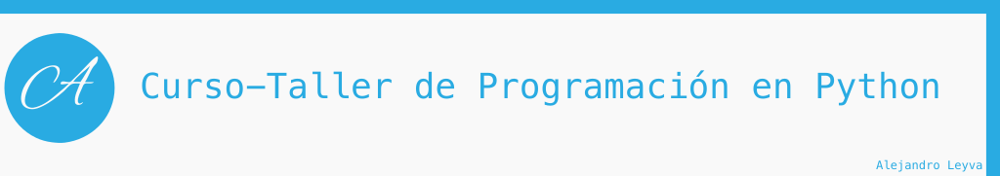
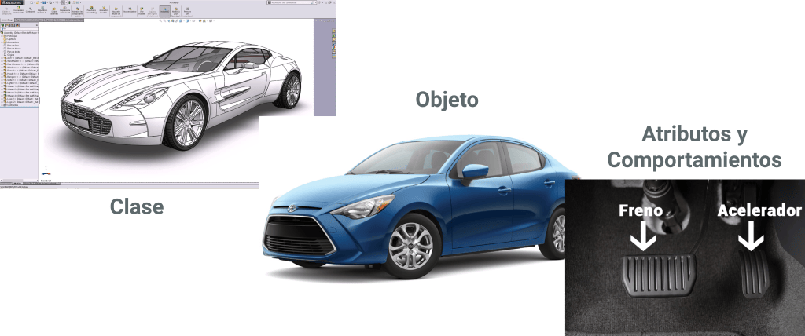
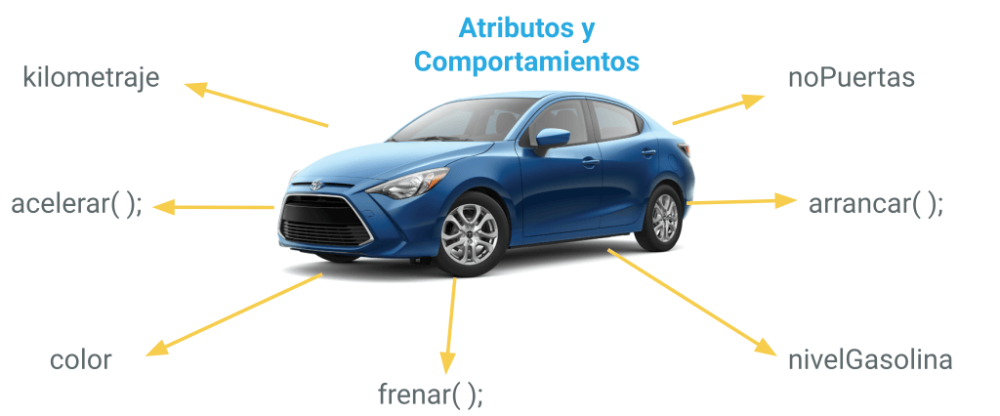

# 15. Programación Orientada a Objetos

La programación orienta a objetos es un paradigma de programación, lo cual esta enfocado en la abstracción del mundo real a código de programación; es decir, es una representación de las cosas del mundo en un archivo con código, el cual tiene los atributos y comportamientos.

>Los programas se construyen a partir de definiciones de objetos y definiciones de funciones; la mayoría de los cómputos se hacen con base en objetos.
>Cada definición de objetos corresponde a algún concepto o cosa del mundo real, y las funciones que operan sobre esos objetos corresponden a las maneras en que los conceptos o cosas reales interactúan

## Clase

**Clase** se le denomina a un archivo que tiene la definición de nuestro objeto o clase.

>La clase es donde se declaran los atributos y métodos.

### Atributos y Comportamientos

Las clases contienen sus atributos y sus métodos (*no siempre es necesario que los tenga*).

### ¿Qué es un atributo?

Es un **campo** que se declara en la clase, por ejemplo, `cantidadPuertas = 4`, indicamos el numero de puertas de nuestra clase `Carro`.

### ¿Qué es un método?

- Es un **comportamiento** (acción) que realiza un objeto (cosa).
- Una secuencia de pasos ordenados.s
- Es un bloque o secuencia de código que se repite continuamente.
- Hace una sola tarea, y lo hace muy bien.
- Su nombre se define con un verbo (acción).
- Funciones de un objeto.
- Modifica estados.

**Los métodos son como las funciones**, pero con dos diferencias:

- Los métodos se definen adentro de una definición de clase, a fin de marcar explícitamente la relación entre la clase y éstos.
- La sintaxis para llamar o invocar un método es distinta que para las funciones.

## Instancia

Una instancia es la creación o invocación de un objetos; es decir, después de crear la clase podemos crear una instancia (objeto) para después, ser usado. Es como en el ejemplo del auto, primer fue diseñado y después, fue construido en una fabrica para ser usado.

## *self*

Al momento de crear una clase se debe ocupar la palabra reservada `self`, la cual indica o hace referencia a la propia clase; indica que el método o campo de la propia clase.

---

Referencia: <https://docs.python.org/es/3/tutorial/classes.html>
