# 17. GUI con QT

Las **interfaces gráficas de usuario** (GUI, por sus siglas en inglés) son esenciales en el desarrollo de aplicaciones modernas. A diferencia de las aplicaciones de línea de comandos, las GUI proporcionan una experiencia más interactiva, intuitiva y accesible para los usuarios, lo que las convierte en la elección ideal para aplicaciones que buscan un público amplio.

## ¿Qué es una GUI?

Una `GUI` es el medio visual e interactivo a través del cual los usuarios se comunican con un sistema o aplicación. Utiliza elementos como ventanas, botones, menús, y cuadros de texto para que los usuarios puedan interactuar sin necesidad de conocer comandos específicos. Por ejemplo, aplicaciones como navegadores web, editores de texto y reproductores multimedia son ejemplos de programas que utilizan interfaces gráficas.

## Ventajas y Desventajas de las GUI

### Ventajas

- Facilidad de uso
    - Las interfaces gráficas son más intuitivas, especialmente para usuarios sin experiencia técnica.
- Experiencia interactiva
    - Permiten arrastrar, soltar, hacer clic y otras acciones directas que enriquecen la interacción.
- Atractivo visual
    - Una GUI bien diseñada puede ser estéticamente agradable y reforzar la identidad de una marca.
- Accesibilidad
    - Las GUI hacen que las aplicaciones sean accesibles a una audiencia más amplia.

### Desventajas

- Mayor complejidad en el desarrollo
    - Diseñar y programar una GUI requiere más tiempo y recursos que desarrollar una aplicación de línea de comandos.
- Uso de recursos
    - Las GUI suelen consumir más memoria y potencia de procesamiento.
- Mantenimiento complicado
    - Modificar o actualizar una GUI puede ser más difícil si no está bien diseñada desde el principio.

## PyQt y Qt: Diseño de Interfaces Gráficas en Python

**Qt** es un framework muy popular para el desarrollo de interfaces gráficas multiplataforma. Ofrece un conjunto completo de herramientas para crear aplicaciones con una apariencia profesional y moderna. PyQt es una biblioteca de Python que actúa como un puente para interactuar con el framework Qt, permitiendo a los desarrolladores trabajar en Python en lugar de C++ (el lenguaje nativo de Qt).

### ¿Por qué usar PyQt?

- Multiplataforma
    - Las aplicaciones creadas con PyQt pueden ejecutarse en Windows, macOS y Linux sin cambios en el código.
- Potencia y flexibilidad
    - Combina las capacidades de Qt con la simplicidad de Python.
- Documentación robusta
    - Qt y PyQt cuentan con una amplia documentación y una comunidad activa.
- Diseño visual
    - Incluye herramientas como Qt Designer, que permiten crear interfaces gráficas mediante un editor visual.

### Qt Designer y PyQt

Qt Designer es una herramienta gráfica que facilita el diseño de interfaces gráficas sin necesidad de escribir código. La interfaz se diseña visualmente y se guarda en archivos `.ui`, que luego pueden ser integrados con código Python utilizando herramientas como `pyuic`.

#### Ventajas de PyQt

- Reducción del tiempo de desarrollo gracias a las herramientas visuales.
- Soporte para una amplia variedad de elementos de interfaz.
- Integración con otros módulos de Python para tareas complejas.

#### Desventajas de PyQt

- La licencia de PyQt puede ser restrictiva para proyectos comerciales, a diferencia de PySide, que también utiliza Qt.
- Dependencia de bibliotecas externas, lo que puede incrementar el tamaño de la aplicación.

## Preparando entorno para crear GUI

### Instalando `PySide6`

Se debe instalar el modulo de `PySide6` o `PyQt6`, pero nos enfocaremos en el primero.

```bash
pip install PySide6
```

`PySide6` es un tipo de meta paquete que contiene todo lo necesario para trabar interfaz gráfica de QT.

> Nota: Lo recomendable es crear un entorno virtual

### QT Designer

Una vez se tiene instalado el metapaquete de PySide6, se descarga la aplicación que podemos usar para la creación y edición de nuestra interfaz gráfica; el cual es `Qt Designer`.
El comando para ejecutarlo es;
nos lanzara en automático la aplicación para crear nuestra aplicación.:

```bash
pyside6-designer
```

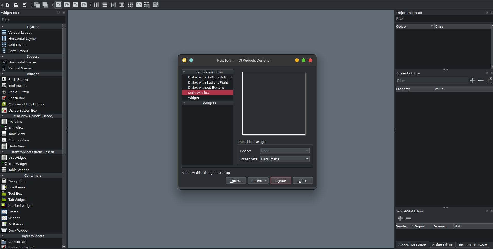

Elegimos la opción de `Main Window` o `Ventana principal`, se creara una ventana base:

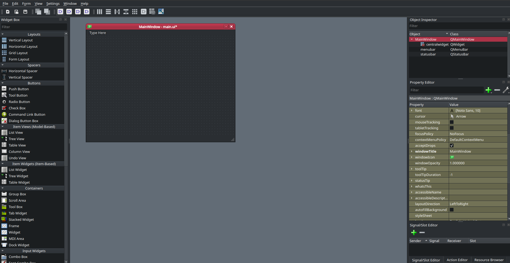

En ella ya podremos construir la interfaz que queramos para nuestra aplicación.

### Convertir un archivo `ui` a `py`

Podemos trabar con los archivo `.ui` que genera `Qt Designer`, sin embargo; es mas recomendable hacer la conversion del archivo, para ello se usa el comando `pyside6-uic` el cual viene dentro del mega paquete de PySide6.

La forma de implementarlo es la siguiente:

```bash
pyside6-uic your_file.ui -o ui_your_file.py
```

### Ejecutando nuestra ventana

Tenemos que crear nuestro archivo principal donde mandamos a llamar a la ventana que hicimos.

`main.py`

```python
import sys  # importo el modulo del sistema para pasar los argumentos a la aplicación
from PySide6.QtWidgets import (
    QApplication,
    QMainWindow,
)  # se deben traer los módulos para crear el contexto de la aplicación

from ui_main_window import Ui_MainWindow


class MiVentanaPrincipal(QMainWindow, Ui_MainWindow):

    # Esta clase me sirve para crear toda la interacción con la ventana, las acciones de los botones, textos, todos los widgets, también se pueden agregar por código lo que sea necesario

    def __init__(self):
        super().__init__()  # inicializo el constructor padre QMainWindow
        self.setupUi(self)  # inicializo mi ventana que viene de Ui_MainWindow


if __name__ == "__main__":

    app = QApplication(sys.argv)    # creo el contexto de la aplicación
    window = MiVentanaPrincipal()   # creo la instancia de mi ventana
    window.show()                   # muestro la ventana
    app.exec()                      # ejecuto la aplicación
```

Archivo `py` generado a partir del archivo `ui`, usando `pyside6-uic`;

> Nota: Este código es autogenerado, no se debe editar, lo que se modifica es el archivo ui.

Archivo: `ui_main.py`

```python
# -*- coding: utf-8 -*-

################################################################################
## Form generated from reading UI file 'main_window.ui'
##
## Created by: Qt User Interface Compiler version 6.8.2
##
## WARNING! All changes made in this file will be lost when recompiling UI file!
################################################################################

from PySide6.QtCore import (QCoreApplication, QDate, QDateTime, QLocale,
    QMetaObject, QObject, QPoint, QRect,
    QSize, QTime, QUrl, Qt)
from PySide6.QtGui import (QBrush, QColor, QConicalGradient, QCursor,
    QFont, QFontDatabase, QGradient, QIcon,
    QImage, QKeySequence, QLinearGradient, QPainter,
    QPalette, QPixmap, QRadialGradient, QTransform)
from PySide6.QtWidgets import (QApplication, QMainWindow, QMenuBar, QSizePolicy,
    QStatusBar, QWidget)

class Ui_MainWindow(object):
    def setupUi(self, MainWindow):
        if not MainWindow.objectName():
            MainWindow.setObjectName(u"MainWindow")
        MainWindow.resize(800, 600)
        self.centralwidget = QWidget(MainWindow)
        self.centralwidget.setObjectName(u"centralwidget")
        MainWindow.setCentralWidget(self.centralwidget)
        self.menubar = QMenuBar(MainWindow)
        self.menubar.setObjectName(u"menubar")
        self.menubar.setGeometry(QRect(0, 0, 800, 23))
        MainWindow.setMenuBar(self.menubar)
        self.statusbar = QStatusBar(MainWindow)
        self.statusbar.setObjectName(u"statusbar")
        MainWindow.setStatusBar(self.statusbar)

        self.retranslateUi(MainWindow)

        QMetaObject.connectSlotsByName(MainWindow)
    # setupUi

    def retranslateUi(self, MainWindow):
        MainWindow.setWindowTitle(QCoreApplication.translate("MainWindow", u"MainWindow", None))
    # retranslateUi
```

## Widgets

### Label (Etiquetas) QLabel

La etiqueta nos ayuda a mostrar texto en la GUI.
La etiqueta se encuentra en la sección de `Display Widgets`, como se ve en la imagen

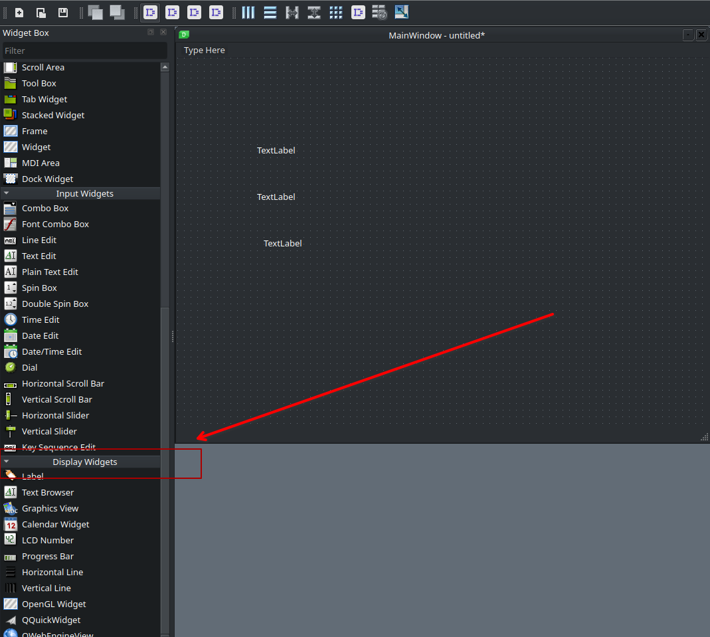

Aquí podemos encontrar las etiquetas que nos sirven para colocar texto dentro de la aplicación.

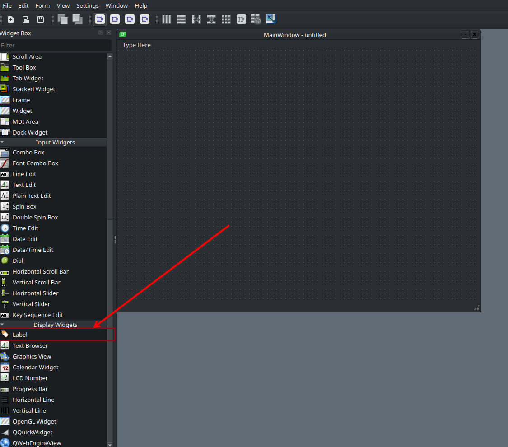

Damos click sobre el `widget` y lo colocamos sobre la ventana.

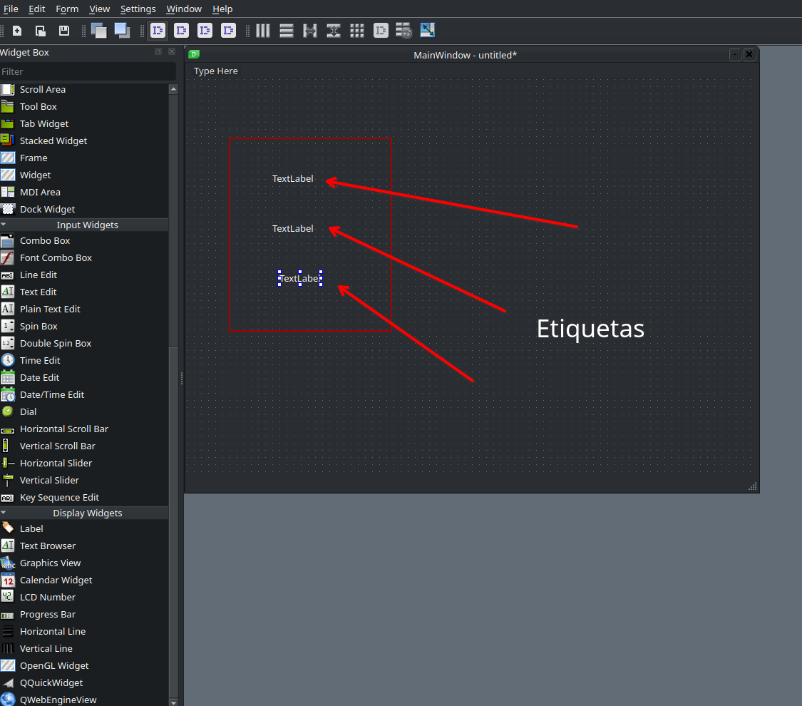

#### Código

Con botones podemos dar interactividad al usuario para realizar acciones.
La etiqueta se encuentra en la sección de `Buttons`, como se ve en la imagen:

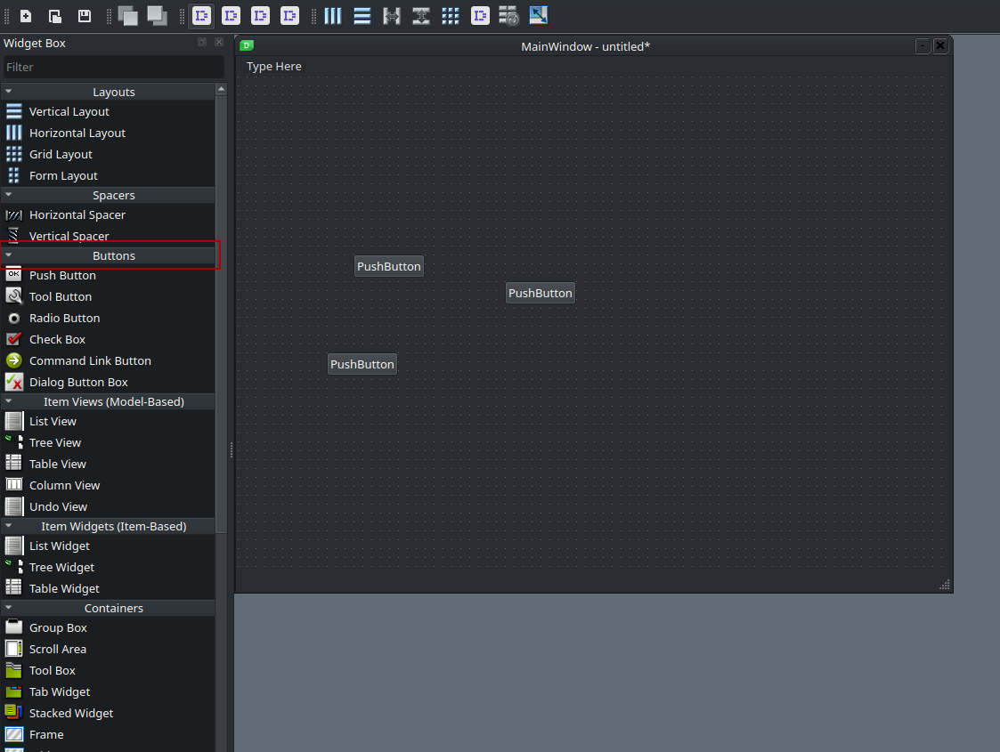

Aquí podemos varios tipos de botones, por el momento nos enfocamos en el primero.

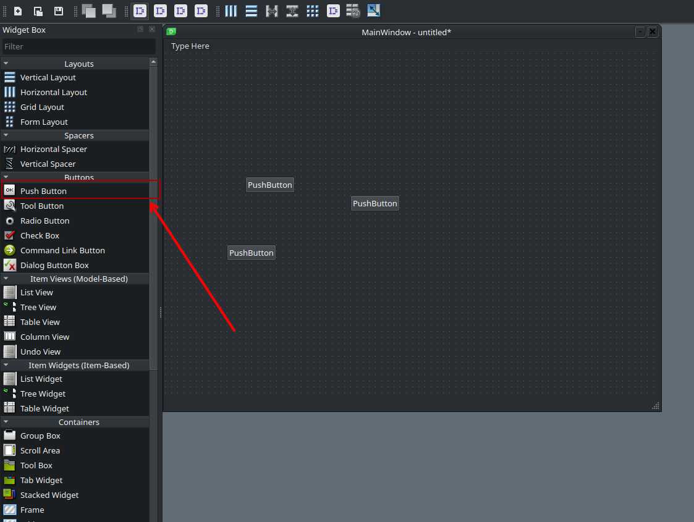

Damos click sobre el `widget` y lo colocamos sobre la ventana.

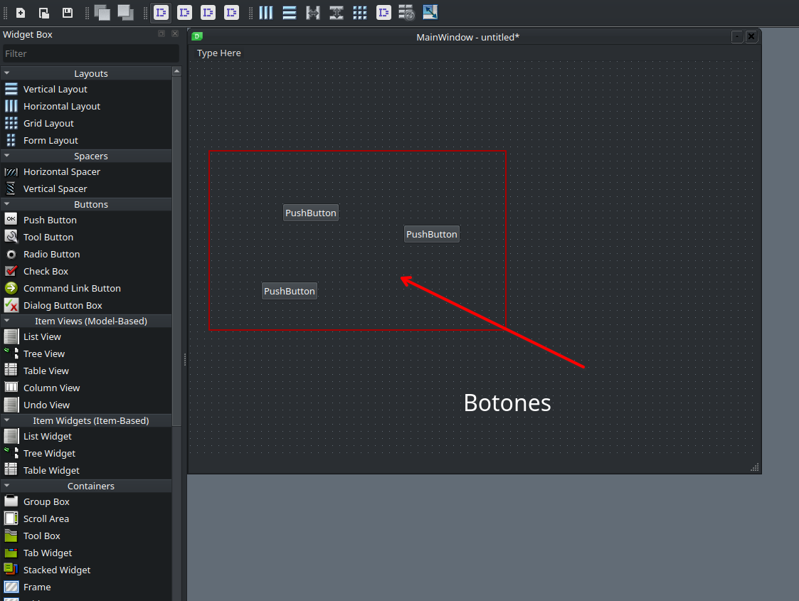

```python
from PySide6.QtWidgets import QLabel # importación de modulo que contiene la clase QLabel

label = QLabel('This is a QLabel widget') # Se crea una instancia de QLabel
```

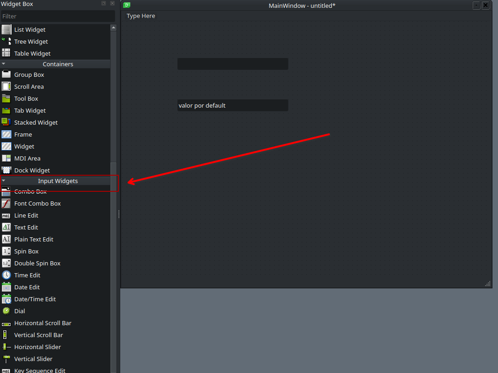

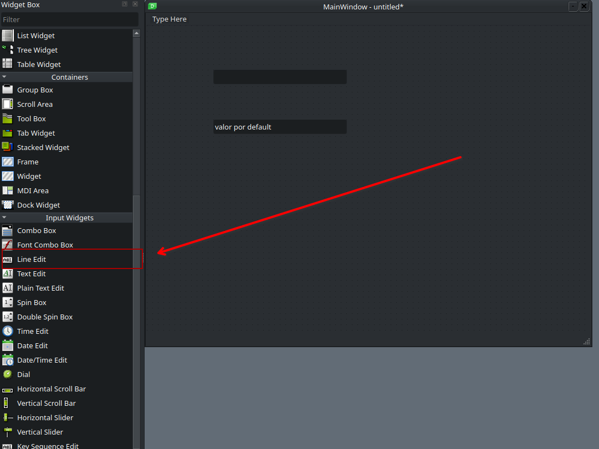

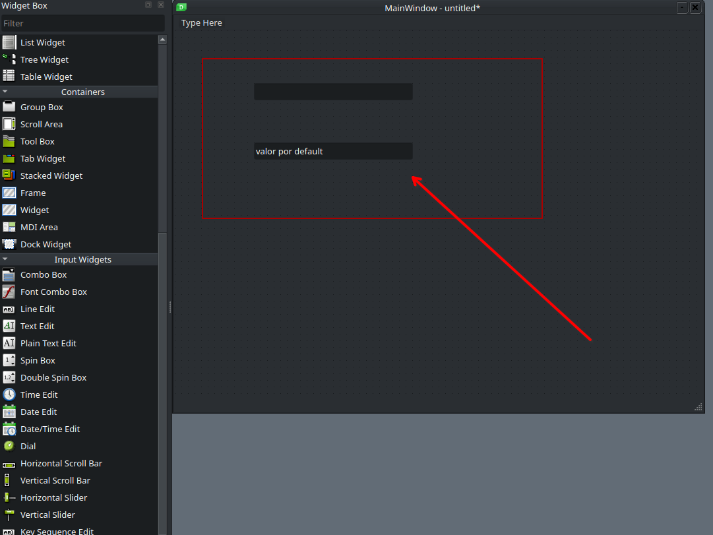

#### Métodos

- `setAlignment()`: Aligns the text as per alignment constants
  - `Qt.AlignLeft`
  - `Qt.AlignRight`
  - `Qt.AlignCenter`
  - `Qt.AlignJustify`
- `setIndent()`: Sets the labels text indent
- `setPixmap()`: Displays an image
- `Text()`: Displays the caption of the label
- `setText()`: Programmatically sets the caption
- `selectedText()`: Displays the selected text from the label (The textInteractionFlag must be set to TextSelectableByMouse)
- `setBuddy()`: Associates the label with any input widget
- `setWordWrap()`: Enables or disables wrapping text in the label

Mas información en <https://doc.qt.io/qt-6/qlabel.html>

### Buttons (Botones) QPushButton

#### Código

```python
from PySide6.QtWidgets import QPushButton # importación de modulo que contiene la clase QPushButton

button = QPushButton("Download", self) # Se crea una instancia de QPushButton
```

#### Métodos

- `setCheckable()`: Recognizes pressed and released states of button if set to true
- `toggle()`: Toggles between checkable states
- `setIcon()`: Shows an icon formed out of `pixmap` of an image file
- `setEnabled()`: When set to false, the button becomes disabled, hence clicking it doesn't emit a signal
- `isChecked()`: Returns Boolean state of button
- `setDefault()`: Sets the button as default
- `setText()`: Programmatically sets buttons caption
- `text()`: Retrieves buttons caption

### Entra de texto (Line Edit) QLineEdit

Este widget es un elemento para ingresar datos y nosotros podamos tomar ese contenido y procesarlo.

#### Código

```python
from PySide6.QtWidgets import QLineEdit # importación de modulo que contiene la clase QLineEdit

line_edit = QLineEdit('Default Value', parent_widget) # Se crea una instancia de QLineEdit
```

#### Métodos

- `setAlignment()`: Aligns the text as per alignment Constants
  - `Qt.AlignLeft`
  - `Qt.AlignRight`
  - `Qt.AlignCenter`
  - `Qt.AlignJustify`
- `clear()`: Erases the contents
- `setEchoMode()`: Controls the appearance of the text inside the box. `Echomode` values are
  - `QLineEdit.`
  - `NormalQLineEdit.`
  - `NoEchoQLineEdit.`
  - `PasswordQLineEdit.`
  - `PasswordEchoOnEdit`
- `setMaxLength()`:Sets the maximum number of characters for input
- `setReadOnly()`: Makes the text box non-editable
- `setText()`: Programmatically sets the text
- `text()`: Retrieves text in the field
- `setValidator()`: Sets the validation rules. Available validators are
  - `QIntValidator`: Restricts input to integer
  - `QDoubleValidator`: Fraction part of number limited to specified decimals
  - `QRegexpValidator`: Checks input against a Regex expression
- `setInputMask()`: Applies mask of combination of characters for input
- `setFont()`: Displays the contents QFont object

#### Ventana de Mensajes - QMessageBox

`QMessageBox` es mayormente usada como `ventana modal` para mostrar información y preguntar al usuario para que responda dando un click en cualquier botón que este dentro de la ventana. Cada botón es estándar y esta definido con un texto, retornar un valor por default en función de la respuesta.

- `setIcon()`: Displays predefined icon corresponding to severity of the message
    - `QuestionQuestion`
    - `InformationInformation`
    - `WarningWarning`
    - `CriticalCritical`
- `setText()`: Sets the text of the main message to be displayed
- `setInformativeText()`: Displays additional information
- `setDetailText()`: Dialog shows a Details button. This text appears on clicking it
- `setTitle()`: Displays the custom title of dialog
- `setStandardButtons()`: List of standard buttons to be displayed. Each button is associated with
    - `QMessageBox.Ok` 0x00000400
    - `QMessageBox.Open` 0x00002000
    - `QMessageBox.Save` 0x00000800
    - `QMessageBox.Cancel` 0x00400000
    - `QMessageBox.Close` 0x00200000
    - `QMessageBox.Yes` 0x00004000
    - `QMessageBox.No` 0x00010000
    - `QMessageBox.Abort` 0x00040000
    - `QMessageBox.Retry` 0x00080000
    - `QMessageBox.Ignore` 0x00100000
- `setDefaultButton()`: Sets the button as default. It emits the clicked signal if Enter is pressed
- `setEscapeButton()`: Sets the button to be treated as clicked if the escape key is pressed

#### Código

```python
def show_info_messagebox():
   msg = QMessageBox()
   msg.setIcon(QMessageBox.Icon.Information)
   msg.setText("Information")
   msg.setWindowTitle("Information MessageBox")
   msg.setStandardButtons(QMessageBox.StandardButton.Ok | QMessageBox.StandardButton.Cancel)
   retval = msg.exec()
def show_warning_messagebox():
   msg = QMessageBox()
   msg.setIcon(QMessageBox.Icon.Warning)
   msg.setText("Warning")
   msg.setWindowTitle("Warning MessageBox")
   msg.setStandardButtons(QMessageBox.StandardButton.Ok | QMessageBox.StandardButton.Cancel)
   retval = msg.exec()
def show_question_messagebox():
   msg = QMessageBox()
   msg.setIcon(QMessageBox.Icon.Question)
   msg.setText("Question")
   msg.setWindowTitle("Question MessageBox")
   msg.setStandardButtons(QMessageBox.StandardButton.Ok | QMessageBox.StandardButton.Cancel)
   retval = msg.exec()
def show_critical_messagebox():
   msg = QMessageBox()
   msg.setIcon(QMessageBox.Icon.Critical)
   msg.setText("Critical")
   msg.setWindowTitle("Critical MessageBox")
   msg.setStandardButtons(QMessageBox.StandardButton.Ok | QMessageBox.StandardButton.Cancel)
   retval = msg.exec()
```

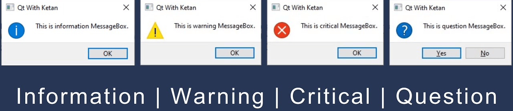

### Layouts

- `QHBoxLayout`: Linear horizontal layout
- `QVBoxLayout`: Linear vertical layout
- `QGridLayout`: In indexable grid `X`x`Y`
- `QStackedLayout`:  Stacked (z) in front of one another

### Signal & Slots (Eventos y Callbacks)

Los `Signal` son la manera de conectar los eventos que se disparan cuando sucede algo con el widget; ejemplo, dar click sobre el elemento, si esto pasa se agrega un `Slot`, que es una función o método en la cual se realizara la acción que hayamos asignado al widget cuando pase este evento.

### Ventanas

#### Main Window (Ventana principal)

Es uno de los componentes más importantes es el `QMainWindow`. Esta clase proporciona la estructura base sobre la cual se construyen muchas aplicaciones de escritorio. `QMainWindow` es una clase que facilita la creación de aplicaciones con una ventana principal que puede **contener menús, barras de herramientas, barras de estado** y otras áreas cruciales para la interacción con el usuario.

#### Dialog (Ventanas de dialog)

Los **cuadros de diálogo** (`QDialog`) son elementos esenciales para interactuar con el usuario. Esta clase proporciona una estructura flexible y sencilla para crear **ventanas modales** o **no modales** que permiten a los usuarios introducir información, hacer selecciones o confirmar acciones.

#### Ventana genérica (QWidget)

Es un widget general donde se puede crear una ventana y dentro de ella colocar más widgets. Gracias a su flexibilidad, `QWidget` se puede utilizar tanto para crear ventanas principales, como para agregar controles y otros elementos visuales dentro de esas ventanas.

## Patrón de diseño MVC

El patrón de diseño MVC (`Model-View-Controller`) es una arquitectura de software que separa una aplicación en tres componentes principales:

### Modelo (Model)

Representa los datos y la lógica de negocio. Se encarga de la gestión de datos, validaciones y reglas de negocio. Puede interactuar con bases de datos o APIs para obtener y actualizar información.

### Vista (View)

Es la interfaz de usuario.Muestra la información al usuario de forma visual.
No contiene lógica de negocio, solo la presentación de datos.

### Controlador (Controller)

Actúa como intermediario entre el Modelo y la Vista.
Recibe las solicitudes del usuario, las procesa y actualiza el Modelo o la Vista según sea necesario.

**Ejemplo Práctico** (en un sistema de gestión de usuarios)

- `Modelo`: Maneja la información de los usuarios en la base de datos.
- `Vista`: Muestra la lista de usuarios en una página web.
- `Controlador`: Recibe la petición del usuario para ver la lista y le solicita al Modelo los datos, luego envía esa información a la Vista para ser mostrada.

## Desarrollo de GUI

### Generador de contraseñas

Se debe realizar una aplicación para la generación de contraseñas seguras, tendrá una entrada para indicar la longitud de la contraseña, un botón para limpiar la contraseña generada y otro botón para copiar la contraseña generada al `clipboard`.

#### Interfaz

##### Interfaz propuesta

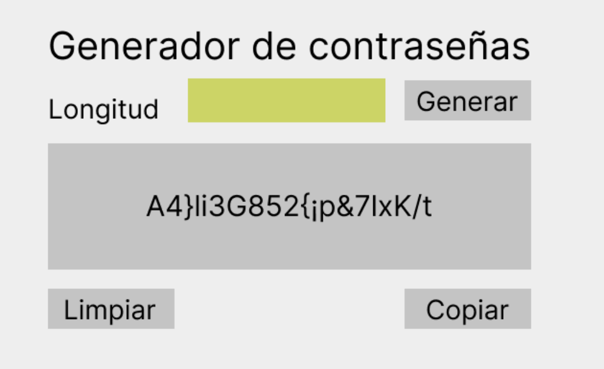

##### Interfaz resultante

Primero se diseña la interfaz que se realizara en `Qt Designer`:

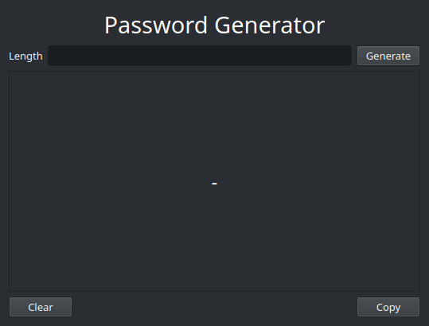

Los nombres de los widgets y su jerarquía

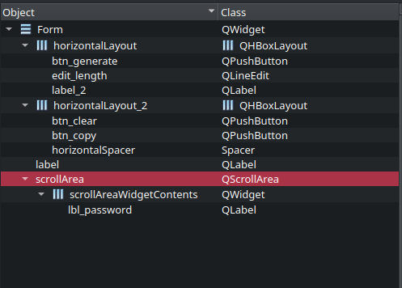

#### Código

`main.py`

```python
import sys

from PySide6.QtWidgets import QApplication, QWidget, QMessageBox
from PySide6.QtGui import QClipboard

from ui_window import Ui_Form
from password_generator import PasswordGenerator


class App(QWidget, Ui_Form):

    def __init__(self):
        super().__init__()
        self.setupUi(self)
        self.init()
        self.pwd = ""

    def init(self):
        """assign the signals to slots"""
        self.btn_clear.clicked.connect(self.clear_password)
        self.btn_generate.clicked.connect(self.generate_password)
        self.btn_copy.clicked.connect(self.copy_password)

    def generate_password(self):

        try:
            length = int(self.edit_length.text())
            self.pwd = PasswordGenerator().generate_password(length=length)
            self.lbl_password.setText(self.pwd)
        except:
            self.message("Error", "JUST NUMBERSS", QMessageBox.Icon.Critical)

    def clear_password(self):
        self.lbl_password.setText("-")
        self.pwd = ""

    def copy_password(self):
        if self.pwd:
            QClipboard().setText(self.pwd)
            self.message("Copied", "The password was copied to clipboard. You can paste", QMessageBox.Icon.Information)
        else:
            self.message("No password", "PASSWORD NOT SETTED", QMessageBox.Icon.Warning)

    def message(self, title, text, icon):
        msg = QMessageBox()
        msg.setIcon(icon)
        msg.setText(text)
        msg.setWindowTitle(title)
        msg.exec()


if __name__ == "__main__":
    app = QApplication(sys.argv)
    window = App()
    window.show()
    sys.exit(app.exec())

```

`ui_window.py`

```python
# -*- coding: utf-8 -*-

################################################################################
## Form generated from reading UI file 'window.ui'
##
## Created by: Qt User Interface Compiler version 6.8.1
##
## WARNING! All changes made in this file will be lost when recompiling UI file!
################################################################################

from PySide6.QtCore import (QCoreApplication, QDate, QDateTime, QLocale,
    QMetaObject, QObject, QPoint, QRect,
    QSize, QTime, QUrl, Qt)
from PySide6.QtGui import (QBrush, QColor, QConicalGradient, QCursor,
    QFont, QFontDatabase, QGradient, QIcon,
    QImage, QKeySequence, QLinearGradient, QPainter,
    QPalette, QPixmap, QRadialGradient, QTransform)
from PySide6.QtWidgets import (QApplication, QHBoxLayout, QLabel, QLayout,
    QLineEdit, QPushButton, QScrollArea, QSizePolicy,
    QSpacerItem, QVBoxLayout, QWidget)

class Ui_Form(object):
    def setupUi(self, Form):
        if not Form.objectName():
            Form.setObjectName(u"Form")
        Form.resize(539, 410)
        self.verticalLayout = QVBoxLayout(Form)
        self.verticalLayout.setObjectName(u"verticalLayout")
        self.verticalLayout.setSizeConstraint(QLayout.SizeConstraint.SetMaximumSize)
        self.label = QLabel(Form)
        self.label.setObjectName(u"label")
        font = QFont()
        font.setPointSize(22)
        self.label.setFont(font)
        self.label.setAlignment(Qt.AlignmentFlag.AlignCenter)

        self.verticalLayout.addWidget(self.label)

        self.horizontalLayout = QHBoxLayout()
        self.horizontalLayout.setObjectName(u"horizontalLayout")
        self.label_2 = QLabel(Form)
        self.label_2.setObjectName(u"label_2")

        self.horizontalLayout.addWidget(self.label_2)

        self.edit_length = QLineEdit(Form)
        self.edit_length.setObjectName(u"edit_length")

        self.horizontalLayout.addWidget(self.edit_length)

        self.btn_generate = QPushButton(Form)
        self.btn_generate.setObjectName(u"btn_generate")

        self.horizontalLayout.addWidget(self.btn_generate)


        self.verticalLayout.addLayout(self.horizontalLayout)

        self.scrollArea = QScrollArea(Form)
        self.scrollArea.setObjectName(u"scrollArea")
        self.scrollArea.setLayoutDirection(Qt.LayoutDirection.LeftToRight)
        self.scrollArea.setWidgetResizable(True)
        self.scrollAreaWidgetContents = QWidget()
        self.scrollAreaWidgetContents.setObjectName(u"scrollAreaWidgetContents")
        self.scrollAreaWidgetContents.setGeometry(QRect(0, 0, 519, 276))
        self.scrollAreaWidgetContents.setLayoutDirection(Qt.LayoutDirection.LeftToRight)
        self.horizontalLayout_3 = QHBoxLayout(self.scrollAreaWidgetContents)
        self.horizontalLayout_3.setObjectName(u"horizontalLayout_3")
        self.lbl_password = QLabel(self.scrollAreaWidgetContents)
        self.lbl_password.setObjectName(u"lbl_password")
        font1 = QFont()
        font1.setPointSize(18)
        self.lbl_password.setFont(font1)
        self.lbl_password.setAlignment(Qt.AlignmentFlag.AlignCenter)
        self.lbl_password.setWordWrap(True)

        self.horizontalLayout_3.addWidget(self.lbl_password)

        self.scrollArea.setWidget(self.scrollAreaWidgetContents)

        self.verticalLayout.addWidget(self.scrollArea)

        self.horizontalLayout_2 = QHBoxLayout()
        self.horizontalLayout_2.setObjectName(u"horizontalLayout_2")
        self.btn_clear = QPushButton(Form)
        self.btn_clear.setObjectName(u"btn_clear")

        self.horizontalLayout_2.addWidget(self.btn_clear)

        self.horizontalSpacer = QSpacerItem(40, 20, QSizePolicy.Policy.Expanding, QSizePolicy.Policy.Minimum)

        self.horizontalLayout_2.addItem(self.horizontalSpacer)

        self.btn_copy = QPushButton(Form)
        self.btn_copy.setObjectName(u"btn_copy")

        self.horizontalLayout_2.addWidget(self.btn_copy)


        self.verticalLayout.addLayout(self.horizontalLayout_2)


        self.retranslateUi(Form)

        QMetaObject.connectSlotsByName(Form)
    # setupUi

    def retranslateUi(self, Form):
        Form.setWindowTitle(QCoreApplication.translate("Form", u"Password Generator", None))
        self.label_2.setText(QCoreApplication.translate("Form", u"Length", None))
        self.btn_generate.setText(QCoreApplication.translate("Form", u"Generate", None))
        self.lbl_password.setText(QCoreApplication.translate("Form", u"-", None))
        self.btn_clear.setText(QCoreApplication.translate("Form", u"Clear", None))
        self.btn_copy.setText(QCoreApplication.translate("Form", u"Copy", None))
    # retranslateUi
```

`password_generator.py`

```python
from random import choice


class PasswordGenerator:
    """Module to generate secure password"""

    def generate_numbers(self) -> list:
        """Generate a list of numbers, from 0 to 9

        Returns:
            list: list of numbers from 0 to 9
        """
        numbers = []

        for i in range(0, 10):
            numbers.append(str(i))

        return numbers

    def generate_symbols(self, length=4) -> str:
        password = ""
        symbols = "!\"#$%&/()=?¿¡'`+',.-_}{[]<>"

        while len(password) < length:
            password += choice(symbols)

        return password

    def generate_password_numbers(self, length=4) -> str:
        """Generate a password with only numbers

        Args:
            length (int, optional): This is the long to be the password. Defaults to 4.

        Returns:
            str: Return the password with only numbers
        """
        password = ""
        numbers = self.generate_numbers()
        while len(password) < length:
            password += choice(numbers)

        return password

    def generate_password_letters(self, length=4) -> str:
        """Generare a password with letter lowercase and uppercase

        Args:
            length (int, optional): The long to be the password. Defaults to 4.

        Returns:
            str: A password with only letters
        """
        password = ""
        letters_low = "abcdefghijklmnopqtstuvwxyz"
        letter_up = letters_low.upper()

        while len(password) < length:
            password += choice(letters_low + letter_up)

        return password

    def generate_password(self, length=4) -> str:
        """Generate a string password with length indicated

        Args:
            length (int, optional): Length for password. Defaults to 4.

        Returns:
            str: password
        """
        password = ""
        while len(password) < length:
            password += choice(
                self.generate_password_letters(length=1)
                + self.generate_password_numbers(1)
                + self.generate_symbols(1)
            )

        return password


# For test the class
if __name__ == "__main__":
    print(PasswordGenerator().generate_password(5))
```

#### Funcionamiento

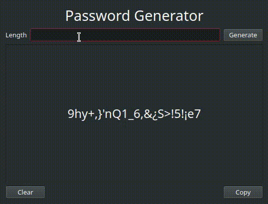

### Ley de Ohms

Aplicación de calculo de ley de ohms.

#### Interfaz

##### Interfaz propuesta


##### Interfaz resultante

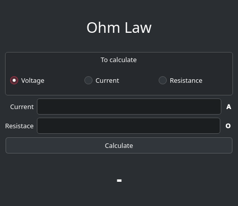

Los nombres de los widgets y su jerarquía


#### Código

`main.py`

```python
```

`ui_window.py`

```python
```

`ohm_lay.py`

```python
class Element:

    def __init__(self, value: float, unit_letter: str):
        self.value = value
        self.unit_letter = unit_letter

    def __str__(self):
        return f"{self.value} {self.unit_letter}"


class Voltage(Element):

    def __init__(self, value):
        super().__init__(value, "V")


class Current(Element):

    def __init__(self, value):
        super().__init__(value, "A")


class Resistance(Element):
    def __init__(self, value):
        super().__init__(value, "Ohms")


class OhmsLaw:

    @staticmethod
    def calculateVoltage(current: Current, resistance: Resistance):
        result = current.value * resistance.value
        return Voltage(result)

    @staticmethod
    def calculateCurrent(voltage: Voltage, current: Current):
        return Current(voltage.value / current.value)

    @staticmethod
    def calculateResistance(voltage: Voltage, current: Current):
        return Resistance(voltage.value / current.value)
```
