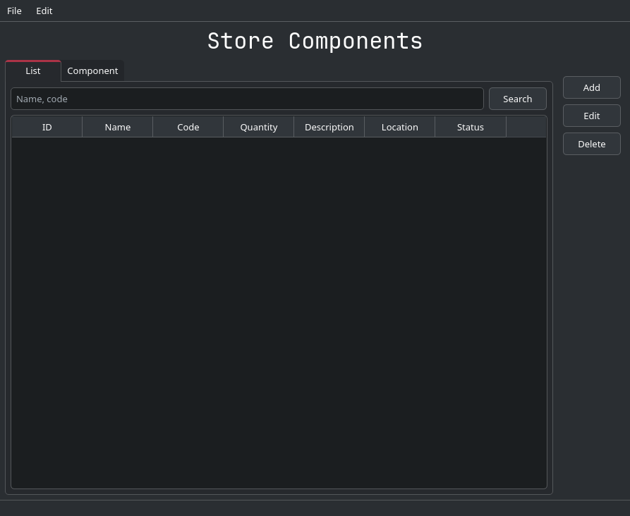
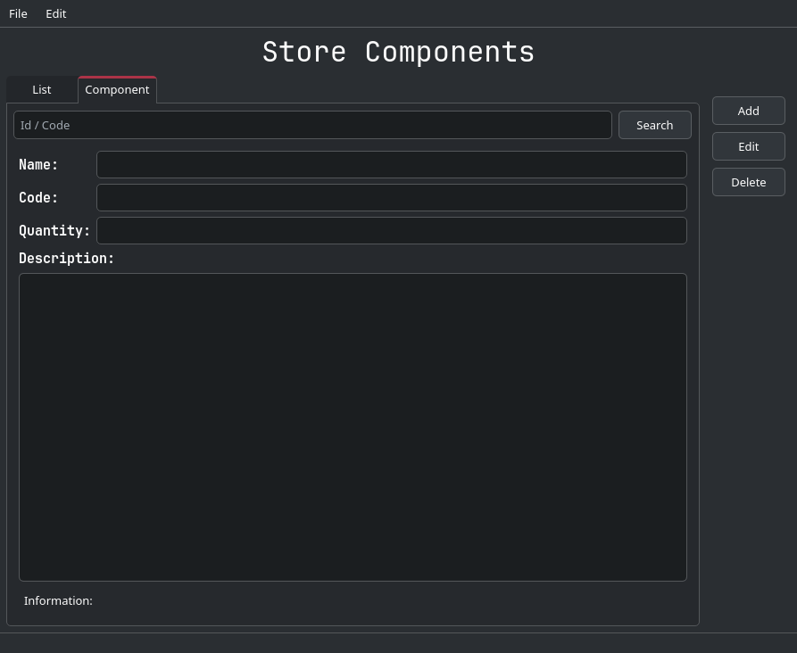
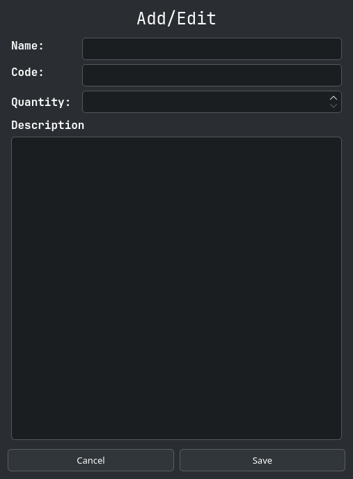
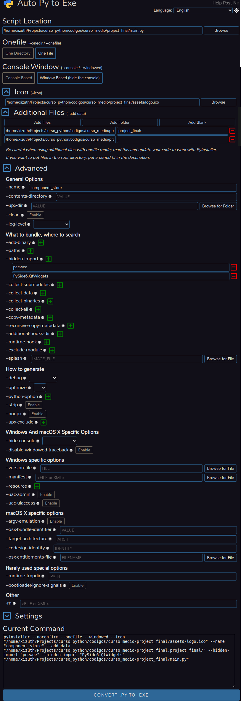
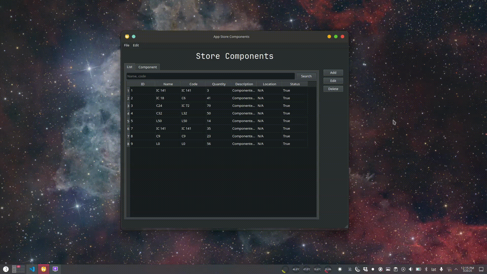

# Proyecto final - Gestor de componentes electrónicos

Vamos a realizar una aplicación visual en la cual se podrán agregar, editar, eliminar y buscar componentes electrónicos, todo esta información estará almacenada en una base de datos local (Sqlite), para poder llevar la aplicación a cualquier lado. Terminando con una aplicación de Desktop empaquetada.

La parte visual se realizara con la herramienta **QT Designer**, y toda la lógica se realizara con *python*, utilizando una arquitectura **MVC**.

## Vistas de la aplicación

### Ventana principal





### Ventana para agregar y editar componentes



## Características

- Persistencia de datos con SQLite (Peewee ORM)
- Multiplataforma

## Estructura del proyecto

```text
├── assets
│   └── logo.ico
├── componente_controller.py
├── component.py
├── form_add_edit_controller.py
├── form_add_edit.ui
├── __init__.py
├── main.py
├── main_window_controller.py
├── main_window.ui
├── ui_form_add_edit.py
└── ui_main_window.py
```

## Desarrollando

Punto de entrada de la aplicación

`main.py`

```python
from PySide6.QtWidgets import QApplication
from main_window_controller import MainWindow

import sys


if __name__ == "__main__":
    app = QApplication(sys.argv)
    window = MainWindow()
    window.show()

    app.exec()
```

`component.py`

```python
from peewee import *

db = SqliteDatabase("components.db")


class ModelComponent(Model):
    id = AutoField()
    name = CharField(max_length=20)
    code = CharField(max_length=10)
    description = TextField(null=True)
    count = IntegerField(default=0)
    location = CharField(default="NA")
    status = BooleanField(default=False)

    def __str__(self):
        return f"[id]: {self.id} - [name] {self.name} - [code]:{self.code} - [count]: {self.count} - [location]: {self.location}"

    class Meta:
        database = db


class Component:

    def __init__(
        self,
        name,
        code,
        status=False,
        description=None,
        id=None,
        location="N/A",
        count=0,
    ):
        self.id = id
        self.name = name
        self.description = description
        self.code = code
        self.count = count
        self.location = location
        self.status = status or bool(count)

    def __str__(self):
        return f"[id]: {self.id} - [name] {self.name} - [code]:{self.code} - [count]: {self.count} - [location]: {self.location}"

    @staticmethod
    def get_columns():
        return ["id", "Name", "Code", "Count", "Description", "Location", "Status"]

    def get_model(self):
        model = {
            "name": self.name,
            "code": self.code,
            "count": self.count,
            "description": self.description,
            "location": self.location,
            "status": bool(self.count),
        }

        if id:
            model["id"] = self.id

        return ModelComponent(**model)

    @staticmethod
    def get_component(component: ModelComponent):
        return Component(
            id=component.id,
            name=component.name,
            code=component.code,
            description=component.description if component.description else "",
            location=component.location if component.location else "",
            count=component.count,
            status=component.status,
        )
```

`componente_controller.py`

```python
from component import *


class ComponentController:

    def __init__(self):
        if not ModelComponent.table_exists():
            ModelComponent.create_table()

    def insert(self, component: Component):
        component.get_model().save()

    def get(self, id):
        return ModelComponent.get_by_id(id)

    def get_all(self):
        return [ Component.get_component(c) for c in ModelComponent.select() ]

    def delete(self, id: int):
        ModelComponent.get_by_id(id).delete_instance()

    def update(self, component: Component):
        component.get_model().save()

    def search_by_code(self, code: str):
        id = int(code) if code.isdigit() else 0

        components_model = ModelComponent.select().where(
            (ModelComponent.id == id) | (ModelComponent.code.contains(code))
        )

        return {
            "components": [Component.get_component(c) for c in components_model],
            "size": components_model.count(),
        }

    def get_size(self):
        return ModelComponent.select().count()

    def search(self, text: str):
        components_model = ModelComponent.select().where(
            (ModelComponent.name.contains(text))
            | (ModelComponent.code.contains(text))
            | (ModelComponent.description.contains(text))
        )

        return {
            "components": [Component.get_component(c) for c in components_model],
            "size": components_model.count(),
        }
```

`form_add_edit_controller.py`

```python
from PySide6.QtWidgets import QWidget

from ui_form_add_edit import Ui_Form
from component import Component


class Form(QWidget, Ui_Form):

    def __init__(self, title: str, component: Component = None, callback=None):
        super().__init__()
        self.setupUi(self)
        self.setWindowTitle(title)
        self.callback = callback  # callback to exec to close
        self.component = component  # el componente a editar
        self.label.setText(title)
        self.init()
        self.component = component
        self.load_data_ui()

    def init(self):
        self.btn_cancel.clicked.connect(self.close_dialog)
        self.btn_save.clicked.connect(self.save)

    def load_data_ui(self):
        if self.component and self.callback:
            self.__load_component_to_ui(component=self.component)

    def __load_component_to_ui(self, component: Component):
        self.input_code.setText(component.code)
        self.input_name.setText(component.name)
        self.input_count.setValue(component.count)
        self.input_description.setPlainText(component.description)

    def get_component_from_ui(self):
        name = self.input_name.text()
        count = int(self.input_count.text())
        description = self.input_description.toPlainText()
        code = self.input_code.text()
        return Component(name=name, count=count, description=description, code=code)

    def save(self):
        if self.component and self.callback:
            component_updated = self.get_component_from_ui()
            component_updated.id = self.component.id
            self.callback(component_updated)
            self.close_dialog()
        elif self.callback:
            self.callback(self.get_component_from_ui())
            self.close_dialog()

    def close_dialog(self):
        self.close()
```

`main_window_controller.py`

```python
from PySide6.QtWidgets import QMainWindow, QTableWidgetItem, QMessageBox
from ui_main_window import Ui_MainWindow
from form_add_edit_controller import Form

from componente_controller import ComponentController
from component import Component


class MainWindow(QMainWindow, Ui_MainWindow):

    dialog = None
    components = None
    TAB_TABLE = 0
    TAB_ONE = 1
    component = None

    def __init__(self):
        super().__init__()
        self.setupUi(self)
        self.init_events()
        self.db = ComponentController()
        self.build_data_table()

    def init_events(self):
        self.btn_add.clicked.connect(self.add_componente)
        self.btn_edit.clicked.connect(self.edit_component)
        self.btn_delete.clicked.connect(self.delete_element)
        self.btn_search_table.clicked.connect(self.search_table)
        self.input_search_table.returnPressed.connect(self.search_table)
        self.btn_search_id.clicked.connect(self.search_one)
        self.input_search_id.returnPressed.connect(self.search_one)

    def build_data_table(self):
        if self.db:
            components = self.db.get_all()
            self.components = components
            size = self.db.get_size()
            self.__load_data_table(components=components, size=size)

    def __load_data_table(self, components: list[Component], size: int):

        self.table_components.setRowCount(size)

        for i, component in enumerate(components):
            self.table_components.setItem(i, 0, QTableWidgetItem(str(component.id)))
            self.table_components.setItem(i, 1, QTableWidgetItem(component.name))
            self.table_components.setItem(i, 2, QTableWidgetItem(component.code))
            self.table_components.setItem(i, 3, QTableWidgetItem(str(component.count)))
            self.table_components.setItem(i, 4, QTableWidgetItem(component.description))
            self.table_components.setItem(i, 5, QTableWidgetItem(component.location))
            self.table_components.setItem(i, 6, QTableWidgetItem(str(component.status)))

    def __build_message(self, component: Component):
        message = QMessageBox(self)
        message.setWindowTitle("Delete Component")
        message.setText(
            f"You're going to delete:<br><strong>[Component: {component.name} with Code: {component.code}]</strong>"
        )
        message.setIcon(QMessageBox.Icon.Warning)
        message.setStandardButtons(
            QMessageBox.StandardButton.Ok | QMessageBox.StandardButton.Cancel
        )
        return message.exec()

    def message_error(self):
        QMessageBox.information(self, "Error", "No component selected")

    def delete_element(self):

        component_to_delete = None
        if self.__get_current_tab() == self.TAB_TABLE:
            component = self.__get_component()
            if component:
                component_to_delete = component

        elif self.__get_current_tab() == self.TAB_ONE:
            if self.component:
                component_to_delete = self.component
        if not component_to_delete:
            self.message_error()

        if component_to_delete:
            answer = self.__build_message(component=component_to_delete)
            if answer == QMessageBox.StandardButton.Ok:
                self.db.delete(component_to_delete.id)

                QMessageBox.information(
                    self, "Deleted", "Componente Deleted Successfully"
                )
            else:
                self.message_error()

            self.build_data_table()
            self.component = None
            self.clear_one()

    def search_table(self):
        word = self.input_search_table.text()
        components_dict = self.db.search(word)
        self.__load_data_table(
            components=components_dict["components"], size=components_dict["size"]
        )

    def search_one(self):
        word = self.input_search_id.text()
        components = self.db.search_by_code(word)
        if components["size"] and word:
            self.component = components["components"][0]
            self.__load_one(self.component)
        else:
            self.clear_one()

    def clear_one(self):
        edits = [
            self.edit_code,
            self.edit_count,
            self.edit_name,
            self.edit_description,
            self.lbl_info,
        ]
        for e in edits:
            e.clear()
        self.component = None

    def __load_one(self, component: Component):

        def text():
            return f"ID: {component.id}\nLocation: {component.location}\nStatus: {component.status}"

        if component:
            self.edit_code.setText(component.code)
            self.edit_count.setText(str(component.count))
            self.edit_name.setText(component.name)
            self.edit_description.setPlainText(component.description)
            self.lbl_info.setText(text())

    def __get_current_tab(self):
        return self.tabWidget.currentIndex()

    def add_componente(self):
        self.dialog = Form("Add component", callback=self.__save_data)
        self.dialog.show()

    def __save_data(self, component: Component):
        self.db.insert(component=component)
        self.build_data_table()

    def edit_component(self):
        title_window = "Edit component"
        if self.__get_current_tab() == self.TAB_TABLE and self.__get_component():
            component = self.__get_component()

            self.dialog = Form(
                title_window,
                callback=self.__update_component,
                component=component,
            )
            self.dialog.show()

        elif self.__get_current_tab() == self.TAB_ONE and self.component:

            self.dialog = Form(
                title_window,
                callback=self.__update_component,
                component=self.component,
            )
            self.dialog.show()
            return
        else:
            self.message_error()

    def __get_component(self):
        i = self.table_components.currentRow()
        if i != -1:
            return self.components[i]

        return None

    def __update_component(self, component):
        self.db.update(component=component)
        self.build_data_table()
```

`form_add_edit.ui`

```xml
<?xml version="1.0" encoding="UTF-8"?>
<ui version="4.0">
 <class>Form</class>
 <widget class="QWidget" name="Form">
  <property name="windowModality">
   <enum>Qt::WindowModality::ApplicationModal</enum>
  </property>
  <property name="geometry">
   <rect>
    <x>0</x>
    <y>0</y>
    <width>507</width>
    <height>687</height>
   </rect>
  </property>
  <property name="windowTitle">
   <string>Form</string>
  </property>
  <layout class="QVBoxLayout" name="verticalLayout_3">
   <item>
    <widget class="QLabel" name="label">
     <property name="font">
      <font>
       <family>JetBrains Mono</family>
       <pointsize>18</pointsize>
      </font>
     </property>
     <property name="text">
      <string>Add/Edit</string>
     </property>
     <property name="alignment">
      <set>Qt::AlignmentFlag::AlignCenter</set>
     </property>
    </widget>
   </item>
   <item>
    <widget class="QWidget" name="widget" native="true">
     <layout class="QVBoxLayout" name="verticalLayout_2">
      <item>
       <layout class="QGridLayout" name="gridLayout">
        <item row="0" column="0">
         <widget class="QLabel" name="label_2">
          <property name="font">
           <font>
            <family>JetBrains Mono</family>
            <pointsize>12</pointsize>
            <bold>true</bold>
           </font>
          </property>
          <property name="text">
           <string>Name:</string>
          </property>
         </widget>
        </item>
        <item row="0" column="1" rowspan="2">
         <widget class="QLineEdit" name="input_name"/>
        </item>
        <item row="1" column="0" rowspan="2">
         <widget class="QLabel" name="label_3">
          <property name="font">
           <font>
            <family>JetBrains Mono</family>
            <pointsize>12</pointsize>
            <bold>true</bold>
           </font>
          </property>
          <property name="text">
           <string>Code:</string>
          </property>
         </widget>
        </item>
        <item row="2" column="1">
         <widget class="QLineEdit" name="input_code"/>
        </item>
        <item row="3" column="0">
         <widget class="QLabel" name="label_4">
          <property name="font">
           <font>
            <family>JetBrains Mono</family>
            <pointsize>12</pointsize>
            <bold>true</bold>
           </font>
          </property>
          <property name="text">
           <string>Quantity: </string>
          </property>
         </widget>
        </item>
        <item row="3" column="1">
         <widget class="QSpinBox" name="input_count"/>
        </item>
       </layout>
      </item>
      <item>
       <layout class="QVBoxLayout" name="verticalLayout">
        <item>
         <widget class="QLabel" name="label_5">
          <property name="font">
           <font>
            <family>JetBrains Mono</family>
            <pointsize>12</pointsize>
            <bold>true</bold>
           </font>
          </property>
          <property name="text">
           <string>Description</string>
          </property>
         </widget>
        </item>
        <item>
         <widget class="QPlainTextEdit" name="input_description"/>
        </item>
       </layout>
      </item>
     </layout>
    </widget>
   </item>
   <item>
    <layout class="QHBoxLayout" name="horizontalLayout">
     <item>
      <widget class="QPushButton" name="btn_cancel">
       <property name="text">
        <string>Cancel</string>
       </property>
      </widget>
     </item>
     <item>
      <widget class="QPushButton" name="btn_save">
       <property name="text">
        <string>Save</string>
       </property>
      </widget>
     </item>
    </layout>
   </item>
  </layout>
 </widget>
 <resources/>
 <connections/>
</ui>
```

`main_window.ui`

```xml
<?xml version="1.0" encoding="UTF-8"?>
<ui version="4.0">
 <class>MainWindow</class>
 <widget class="QMainWindow" name="MainWindow">
  <property name="geometry">
   <rect>
    <x>0</x>
    <y>0</y>
    <width>893</width>
    <height>732</height>
   </rect>
  </property>
  <property name="windowTitle">
   <string>App Store Components</string>
  </property>
  <widget class="QWidget" name="centralwidget">
   <layout class="QVBoxLayout" name="verticalLayout_2">
    <item>
     <widget class="QLabel" name="label">
      <property name="font">
       <font>
        <family>JetBrains Mono</family>
        <pointsize>24</pointsize>
       </font>
      </property>
      <property name="text">
       <string>Store Components</string>
      </property>
      <property name="alignment">
       <set>Qt::AlignmentFlag::AlignCenter</set>
      </property>
     </widget>
    </item>
    <item>
     <layout class="QGridLayout" name="gridLayout">
      <item row="0" column="1">
       <widget class="QWidget" name="widget" native="true">
        <layout class="QVBoxLayout" name="verticalLayout">
         <item>
          <spacer name="verticalSpacer_2">
           <property name="orientation">
            <enum>Qt::Orientation::Vertical</enum>
           </property>
           <property name="sizeType">
            <enum>QSizePolicy::Policy::Preferred</enum>
           </property>
           <property name="sizeHint" stdset="0">
            <size>
             <width>20</width>
             <height>16</height>
            </size>
           </property>
          </spacer>
         </item>
         <item>
          <widget class="QPushButton" name="btn_add">
           <property name="text">
            <string>Add</string>
           </property>
          </widget>
         </item>
         <item>
          <widget class="QPushButton" name="btn_edit">
           <property name="text">
            <string>Edit</string>
           </property>
          </widget>
         </item>
         <item>
          <widget class="QPushButton" name="btn_delete">
           <property name="text">
            <string>Delete</string>
           </property>
          </widget>
         </item>
         <item>
          <spacer name="verticalSpacer">
           <property name="orientation">
            <enum>Qt::Orientation::Vertical</enum>
           </property>
           <property name="sizeHint" stdset="0">
            <size>
             <width>20</width>
             <height>40</height>
            </size>
           </property>
          </spacer>
         </item>
        </layout>
       </widget>
      </item>
      <item row="0" column="0">
       <widget class="QTabWidget" name="tabWidget">
        <property name="currentIndex">
         <number>0</number>
        </property>
        <widget class="QWidget" name="tab">
         <attribute name="title">
          <string>List</string>
         </attribute>
         <layout class="QVBoxLayout" name="verticalLayout_3">
          <item>
           <layout class="QHBoxLayout" name="horizontalLayout">
            <item>
             <widget class="QLineEdit" name="input_search_table">
              <property name="placeholderText">
               <string>Name, code</string>
              </property>
             </widget>
            </item>
            <item>
             <widget class="QPushButton" name="btn_search_table">
              <property name="text">
               <string>Search</string>
              </property>
             </widget>
            </item>
           </layout>
          </item>
          <item>
           <widget class="QTableWidget" name="table_components">
            <property name="editTriggers">
             <set>QAbstractItemView::EditTrigger::NoEditTriggers</set>
            </property>
            <property name="rowCount">
             <number>0</number>
            </property>
            <property name="columnCount">
             <number>7</number>
            </property>
            <column>
             <property name="text">
              <string>ID</string>
             </property>
            </column>
            <column>
             <property name="text">
              <string>Name</string>
             </property>
            </column>
            <column>
             <property name="text">
              <string>Code</string>
             </property>
            </column>
            <column>
             <property name="text">
              <string>Quantity</string>
             </property>
            </column>
            <column>
             <property name="text">
              <string>Description</string>
             </property>
            </column>
            <column>
             <property name="text">
              <string>Location</string>
             </property>
            </column>
            <column>
             <property name="text">
              <string>Status</string>
             </property>
            </column>
           </widget>
          </item>
         </layout>
        </widget>
        <widget class="QWidget" name="tab_2">
         <attribute name="title">
          <string>Component</string>
         </attribute>
         <layout class="QVBoxLayout" name="verticalLayout_4">
          <item>
           <layout class="QHBoxLayout" name="horizontalLayout_2">
            <item>
             <widget class="QLineEdit" name="input_search_id">
              <property name="placeholderText">
               <string>Id / Code</string>
              </property>
             </widget>
            </item>
            <item>
             <widget class="QPushButton" name="btn_search_id">
              <property name="text">
               <string>Search</string>
              </property>
             </widget>
            </item>
           </layout>
          </item>
          <item>
           <widget class="QFrame" name="frame">
            <property name="sizePolicy">
             <sizepolicy hsizetype="Expanding" vsizetype="Expanding">
              <horstretch>0</horstretch>
              <verstretch>0</verstretch>
             </sizepolicy>
            </property>
            <property name="frameShape">
             <enum>QFrame::Shape::StyledPanel</enum>
            </property>
            <property name="frameShadow">
             <enum>QFrame::Shadow::Raised</enum>
            </property>
            <layout class="QVBoxLayout" name="verticalLayout_6">
             <item>
              <layout class="QGridLayout" name="gridLayout_2">
               <item row="0" column="0">
                <widget class="QLabel" name="label_2">
                 <property name="sizePolicy">
                  <sizepolicy hsizetype="Preferred" vsizetype="Preferred">
                   <horstretch>0</horstretch>
                   <verstretch>0</verstretch>
                  </sizepolicy>
                 </property>
                 <property name="font">
                  <font>
                   <family>JetBrains Mono</family>
                   <pointsize>11</pointsize>
                   <bold>true</bold>
                  </font>
                 </property>
                 <property name="text">
                  <string>Name:</string>
                 </property>
                </widget>
               </item>
               <item row="0" column="1">
                <widget class="QLineEdit" name="edit_name">
                 <property name="font">
                  <font>
                   <family>JetBrains Mono</family>
                  </font>
                 </property>
                 <property name="text">
                  <string/>
                 </property>
                 <property name="readOnly">
                  <bool>true</bool>
                 </property>
                </widget>
               </item>
               <item row="1" column="0">
                <widget class="QLabel" name="label_3">
                 <property name="sizePolicy">
                  <sizepolicy hsizetype="Preferred" vsizetype="Preferred">
                   <horstretch>0</horstretch>
                   <verstretch>0</verstretch>
                  </sizepolicy>
                 </property>
                 <property name="font">
                  <font>
                   <family>JetBrains Mono</family>
                   <pointsize>11</pointsize>
                   <bold>true</bold>
                  </font>
                 </property>
                 <property name="text">
                  <string>Code:</string>
                 </property>
                </widget>
               </item>
               <item row="1" column="1">
                <widget class="QLineEdit" name="edit_code">
                 <property name="font">
                  <font>
                   <family>JetBrains Mono</family>
                  </font>
                 </property>
                 <property name="text">
                  <string/>
                 </property>
                 <property name="readOnly">
                  <bool>true</bool>
                 </property>
                </widget>
               </item>
               <item row="2" column="0">
                <widget class="QLabel" name="label_4">
                 <property name="font">
                  <font>
                   <family>JetBrains Mono</family>
                   <pointsize>11</pointsize>
                   <bold>true</bold>
                  </font>
                 </property>
                 <property name="text">
                  <string>Quantity:</string>
                 </property>
                </widget>
               </item>
               <item row="2" column="1">
                <widget class="QLineEdit" name="edit_count">
                 <property name="font">
                  <font>
                   <family>JetBrains Mono</family>
                  </font>
                 </property>
                 <property name="text">
                  <string/>
                 </property>
                 <property name="readOnly">
                  <bool>true</bool>
                 </property>
                </widget>
               </item>
              </layout>
             </item>
             <item>
              <layout class="QVBoxLayout" name="verticalLayout_5">
               <item>
                <widget class="QLabel" name="label_5">
                 <property name="font">
                  <font>
                   <family>JetBrains Mono</family>
                   <pointsize>11</pointsize>
                   <bold>true</bold>
                  </font>
                 </property>
                 <property name="text">
                  <string>Description:</string>
                 </property>
                </widget>
               </item>
               <item>
                <widget class="QPlainTextEdit" name="edit_description">
                 <property name="font">
                  <font>
                   <family>JetBrains Mono</family>
                  </font>
                 </property>
                 <property name="readOnly">
                  <bool>true</bool>
                 </property>
                 <property name="plainText">
                  <string/>
                 </property>
                 <property name="textInteractionFlags">
                  <set>Qt::TextInteractionFlag::TextSelectableByMouse</set>
                 </property>
                </widget>
               </item>
              </layout>
             </item>
             <item>
              <widget class="QWidget" name="widget_2" native="true">
               <layout class="QVBoxLayout" name="verticalLayout_7">
                <item>
                 <widget class="QLabel" name="lbl_info">
                  <property name="sizePolicy">
                   <sizepolicy hsizetype="Expanding" vsizetype="Preferred">
                    <horstretch>0</horstretch>
                    <verstretch>0</verstretch>
                   </sizepolicy>
                  </property>
                  <property name="text">
                   <string>Information:</string>
                  </property>
                 </widget>
                </item>
               </layout>
              </widget>
             </item>
            </layout>
           </widget>
          </item>
         </layout><?xml version="1.0" encoding="UTF-8"?>
<ui version="4.0">
 <class>MainWindow</class>
 <widget class="QMainWindow" name="MainWindow">
  <property name="geometry">
   <rect>
    <x>0</x>
    <y>0</y>
    <width>893</width>
    <height>732</height>
   </rect>
  </property>
  <property name="windowTitle">
   <string>App Store Components</string>
  </property>
  <widget class="QWidget" name="centralwidget">
   <layout class="QVBoxLayout" name="verticalLayout_2">
    <item>
     <widget class="QLabel" name="label">
      <property name="font">
       <font>
        <family>JetBrains Mono</family>
        <pointsize>24</pointsize>
       </font>
      </property>
      <property name="text">
       <string>Store Components</string>
      </property>
      <property name="alignment">
       <set>Qt::AlignmentFlag::AlignCenter</set>
      </property>
     </widget>
    </item>
    <item>
     <layout class="QGridLayout" name="gridLayout">
      <item row="0" column="1">
       <widget class="QWidget" name="widget" native="true">
        <layout class="QVBoxLayout" name="verticalLayout">
         <item>
          <spacer name="verticalSpacer_2">
           <property name="orientation">
            <enum>Qt::Orientation::Vertical</enum>
           </property>
           <property name="sizeType">
            <enum>QSizePolicy::Policy::Preferred</enum>
           </property>
           <property name="sizeHint" stdset="0">
            <size>
             <width>20</width>
             <height>16</height>
            </size>
           </property>
          </spacer>
         </item>
         <item>
          <widget class="QPushButton" name="btn_add">
           <property name="text">
            <string>Add</string>
           </property>
          </widget>
         </item>
         <item>
          <widget class="QPushButton" name="btn_edit">
           <property name="text">
            <string>Edit</string>
           </property>
          </widget>
         </item>
         <item>
          <widget class="QPushButton" name="btn_delete">
           <property name="text">
            <string>Delete</string>
           </property>
          </widget>
         </item>
         <item>
          <spacer name="verticalSpacer">
           <property name="orientation">
            <enum>Qt::Orientation::Vertical</enum>
           </property>
           <property name="sizeHint" stdset="0">
            <size>
             <width>20</width>
             <height>40</height>
            </size>
           </property>
          </spacer>
         </item>
        </layout>
       </widget>
      </item>
      <item row="0" column="0">
       <widget class="QTabWidget" name="tabWidget">
        <property name="currentIndex">
         <number>0</number>
        </property>
        <widget class="QWidget" name="tab">
         <attribute name="title">
          <string>List</string>
         </attribute>
         <layout class="QVBoxLayout" name="verticalLayout_3">
          <item>
           <layout class="QHBoxLayout" name="horizontalLayout">
            <item>
             <widget class="QLineEdit" name="input_search_table">
              <property name="placeholderText">
               <string>Name, code</string>
              </property>
             </widget>
            </item>
            <item>
             <widget class="QPushButton" name="btn_search_table">
              <property name="text">
               <string>Search</string>
              </property>
             </widget>
            </item>
           </layout>
          </item>
          <item>
           <widget class="QTableWidget" name="table_components">
            <property name="editTriggers">
             <set>QAbstractItemView::EditTrigger::NoEditTriggers</set>
            </property>
            <property name="rowCount">
             <number>0</number>
            </property>
            <property name="columnCount">
             <number>7</number>
            </property>
            <column>
             <property name="text">
              <string>ID</string>
             </property>
            </column>
            <column>
             <property name="text">
              <string>Name</string>
             </property>
            </column>
            <column>
             <property name="text">
              <string>Code</string>
             </property>
            </column>
            <column>
             <property name="text">
              <string>Quantity</string>
             </property>
            </column>
            <column>
             <property name="text">
              <string>Description</string>
             </property>
            </column>
            <column>
             <property name="text">
              <string>Location</string>
             </property>
            </column>
            <column>
             <property name="text">
              <string>Status</string>
             </property>
            </column>
           </widget>
          </item>
         </layout>
        </widget>
        <widget class="QWidget" name="tab_2">
         <attribute name="title">
          <string>Component</string>
         </attribute>
         <layout class="QVBoxLayout" name="verticalLayout_4">
          <item>
           <layout class="QHBoxLayout" name="horizontalLayout_2">
            <item>
             <widget class="QLineEdit" name="input_search_id">
              <property name="placeholderText">
               <string>Id / Code</string>
              </property>
             </widget>
            </item>
            <item>
             <widget class="QPushButton" name="btn_search_id">
              <property name="text">
               <string>Search</string>
              </property>
             </widget>
            </item>
           </layout>
          </item>
          <item>
           <widget class="QFrame" name="frame">
            <property name="sizePolicy">
             <sizepolicy hsizetype="Expanding" vsizetype="Expanding">
              <horstretch>0</horstretch>
              <verstretch>0</verstretch>
             </sizepolicy>
            </property>
            <property name="frameShape">
             <enum>QFrame::Shape::StyledPanel</enum>
            </property>
            <property name="frameShadow">
             <enum>QFrame::Shadow::Raised</enum>
            </property>
            <layout class="QVBoxLayout" name="verticalLayout_6">
             <item>
              <layout class="QGridLayout" name="gridLayout_2">
               <item row="0" column="0">
                <widget class="QLabel" name="label_2">
                 <property name="sizePolicy">
                  <sizepolicy hsizetype="Preferred" vsizetype="Preferred">
                   <horstretch>0</horstretch>
                   <verstretch>0</verstretch>
                  </sizepolicy>
                 </property>
                 <property name="font">
                  <font>
                   <family>JetBrains Mono</family>
                   <pointsize>11</pointsize>
                   <bold>true</bold>
                  </font>
                 </property>
                 <property name="text">
                  <string>Name:</string>
                 </property>
                </widget>
               </item>
               <item row="0" column="1">
                <widget class="QLineEdit" name="edit_name">
                 <property name="font">
                  <font>
                   <family>JetBrains Mono</family>
                  </font>
                 </property>
                 <property name="text">
                  <string/>
                 </property>
                 <property name="readOnly">
                  <bool>true</bool>
                 </property>
                </widget>
               </item>
               <item row="1" column="0">
                <widget class="QLabel" name="label_3">
                 <property name="sizePolicy">
                  <sizepolicy hsizetype="Preferred" vsizetype="Preferred">
                   <horstretch>0</horstretch>
                   <verstretch>0</verstretch>
                  </sizepolicy>
                 </property>
                 <property name="font">
                  <font>
                   <family>JetBrains Mono</family>
                   <pointsize>11</pointsize>
                   <bold>true</bold>
                  </font>
                 </property>
                 <property name="text">
                  <string>Code:</string>
                 </property>
                </widget>
               </item>
               <item row="1" column="1">
                <widget class="QLineEdit" name="edit_code">
                 <property name="font">
                  <font>
                   <family>JetBrains Mono</family>
                  </font>
                 </property>
                 <property name="text">
                  <string/>
                 </property>
                 <property name="readOnly">
                  <bool>true</bool>
                 </property>
                </widget>
               </item>
               <item row="2" column="0">
                <widget class="QLabel" name="label_4">
                 <property name="font">
                  <font>
                   <family>JetBrains Mono</family>
                   <pointsize>11</pointsize>
                   <bold>true</bold>
                  </font>
                 </property>
                 <property name="text">
                  <string>Quantity:</string>
                 </property>
                </widget>
               </item>
               <item row="2" column="1">
                <widget class="QLineEdit" name="edit_count">
                 <property name="font">
                  <font>
                   <family>JetBrains Mono</family>
                  </font>
                 </property>
                 <property name="text">
                  <string/>
                 </property>
                 <property name="readOnly">
                  <bool>true</bool>
                 </property>
                </widget>
               </item>
              </layout>
             </item>
             <item>
              <layout class="QVBoxLayout" name="verticalLayout_5">
               <item>
                <widget class="QLabel" name="label_5">
                 <property name="font">
                  <font>
                   <family>JetBrains Mono</family>
                   <pointsize>11</pointsize>
                   <bold>true</bold>
                  </font>
                 </property>
                 <property name="text">
                  <string>Description:</string>
                 </property>
                </widget>
               </item>
               <item>
                <widget class="QPlainTextEdit" name="edit_description">
                 <property name="font">
                  <font>
                   <family>JetBrains Mono</family>
                  </font>
                 </property>
                 <property name="readOnly">
                  <bool>true</bool>
                 </property>
                 <property name="plainText">
                  <string/>
                 </property>
                 <property name="textInteractionFlags">
                  <set>Qt::TextInteractionFlag::TextSelectableByMouse</set>
                 </property>
                </widget>
               </item>
              </layout>
             </item>
             <item>
              <widget class="QWidget" name="widget_2" native="true">
               <layout class="QVBoxLayout" name="verticalLayout_7">
                <item>
                 <widget class="QLabel" name="lbl_info">
                  <property name="sizePolicy">
                   <sizepolicy hsizetype="Expanding" vsizetype="Preferred">
                    <horstretch>0</horstretch>
                    <verstretch>0</verstretch>
                   </sizepolicy>
                  </property>
                  <property name="text">
                   <string>Information:</string>
                  </property>
                 </widget>
                </item>
               </layout>
              </widget>
             </item>
            </layout>
           </widget>
          </item>
         </layout>
        </widget>
       </widget>
      </item>
     </layout>
    </item>
   </layout>
  </widget>
  <widget class="QMenuBar" name="menubar">
   <property name="geometry">
    <rect>
     <x>0</x>
     <y>0</y>
     <width>893</width>
     <height>30</height>
    </rect>
   </property>
   <widget class="QMenu" name="menuArchivo">
    <property name="title">
     <string>File</string>
    </property>
    <addaction name="actionAgregar_componente"/>
    <addaction name="actionEditar_componente"/>
    <addaction name="separator"/>
    <addaction name="actionSalir"/>
   </widget>
   <widget class="QMenu" name="menuEdici_n">
    <property name="title">
     <string>Edit</string>
    </property>
    <addaction name="actionAdegar_componente"/>
    <addaction name="actionEditar_componente_2"/>
    <addaction name="actionEliminar_componente"/>
   </widget>
   <addaction name="menuArchivo"/>
   <addaction name="menuEdici_n"/>
  </widget>
  <widget class="QStatusBar" name="statusbar"/>
  <action name="actionAgregar_componente">
   <property name="text">
    <string>Export components</string>
   </property>
  </action>
  <action name="actionEditar_componente">
   <property name="text">
    <string>Export all components</string>
   </property>
  </action>
  <action name="actionAdegar_componente">
   <property name="text">
    <string>Add component</string>
   </property>
  </action>
  <action name="actionEditar_componente_2">
   <property name="text">
    <string>Edit component</string>
   </property>
  </action>
  <action name="actionEliminar_componente">
   <property name="text">
    <string>Delete component</string>
   </property>
  </action>
  <action name="actionSalir">
   <property name="text">
    <string>Quit</string>
   </property>
   <property name="shortcut">
    <string>Ctrl+Q</string>
   </property>
  </action>
  <action name="actionotro">
   <property name="text">
    <string>otro</string>
   </property>
  </action>
 </widget>
 <tabstops>
  <tabstop>input_search_table</tabstop>
  <tabstop>btn_search_table</tabstop>
  <tabstop>btn_add</tabstop>
  <tabstop>btn_edit</tabstop>
  <tabstop>btn_delete</tabstop>
  <tabstop>tabWidget</tabstop>
  <tabstop>input_search_id</tabstop>
  <tabstop>btn_search_id</tabstop>
  <tabstop>edit_code</tabstop>
  <tabstop>edit_count</tabstop>
  <tabstop>table_components</tabstop>
  <tabstop>edit_name</tabstop>
  <tabstop>edit_description</tabstop>
 </tabstops>
 <resources/>
 <connections/>
</ui>

        </widget>
       </widget>
      </item>
     </layout>
    </item>
   </layout>
  </widget>
  <widget class="QMenuBar" name="menubar">
   <property name="geometry">
    <rect>
     <x>0</x>
     <y>0</y>
     <width>893</width>
     <height>30</height>
    </rect>
   </property>
   <widget class="QMenu" name="menuArchivo">
    <property name="title">
     <string>File</string>
    </property>
    <addaction name="actionAgregar_componente"/>
    <addaction name="actionEditar_componente"/>
    <addaction name="separator"/>
    <addaction name="actionSalir"/>
   </widget>
   <widget class="QMenu" name="menuEdici_n">
    <property name="title">
     <string>Edit</string>
    </property>
    <addaction name="actionAdegar_componente"/>
    <addaction name="actionEditar_componente_2"/>
    <addaction name="actionEliminar_componente"/>
   </widget>
   <addaction name="menuArchivo"/>
   <addaction name="menuEdici_n"/>
  </widget>
  <widget class="QStatusBar" name="statusbar"/>
  <action name="actionAgregar_componente">
   <property name="text">
    <string>Export components</string>
   </property>
  </action>
  <action name="actionEditar_componente">
   <property name="text">
    <string>Export all components</string>
   </property>
  </action>
  <action name="actionAdegar_componente">
   <property name="text">
    <string>Add component</string>
   </property>
  </action>
  <action name="actionEditar_componente_2">
   <property name="text">
    <string>Edit component</string>
   </property>
  </action>
  <action name="actionEliminar_componente">
   <property name="text">
    <string>Delete component</string>
   </property>
  </action>
  <action name="actionSalir">
   <property name="text">
    <string>Quit</string>
   </property>
   <property name="shortcut">
    <string>Ctrl+Q</string>
   </property>
  </action>
  <action name="actionotro">
   <property name="text">
    <string>otro</string>
   </property>
  </action>
 </widget>
 <tabstops>
  <tabstop>input_search_table</tabstop>
  <tabstop>btn_search_table</tabstop>
  <tabstop>btn_add</tabstop>
  <tabstop>btn_edit</tabstop>
  <tabstop>btn_delete</tabstop>
  <tabstop>tabWidget</tabstop>
  <tabstop>input_search_id</tabstop>
  <tabstop>btn_search_id</tabstop>
  <tabstop>edit_code</tabstop>
  <tabstop>edit_count</tabstop>
  <tabstop>table_components</tabstop>
  <tabstop>edit_name</tabstop>
  <tabstop>edit_description</tabstop>
 </tabstops>
 <resources/>
 <connections/>
</ui>
```

## Empaquetando aplicación

Instalar `install auto-py-to-exe`

```bash
pip install auto-py-to-exe

auto-py-to-exe
```

El comando resultado dado por `auto-py-to-exec`:

```bash
pyinstaller --noconfirm --onefile --windowed --icon "/home/xizuth/Projects/curso_python/codigos/curso_medio/project_final/assets/logo.ico" --name "component_store" --add-data "/home/xizuth/Projects/curso_python/codigos/curso_medio/project_final:project_final/" --hidden-import "peewee" --hidden-import "PySide6.QtWidgets" --add-data "/home/xizuth/Projects/curso_python/codigos/curso_medio/project_final:."  "/home/xizuth/Projects/curso_python/codigos/curso_medio/project_final/main.py"
```

> Nota: toma en cuenta se deben ajustar las rutas para tu sistema y usuario



## Resultado


